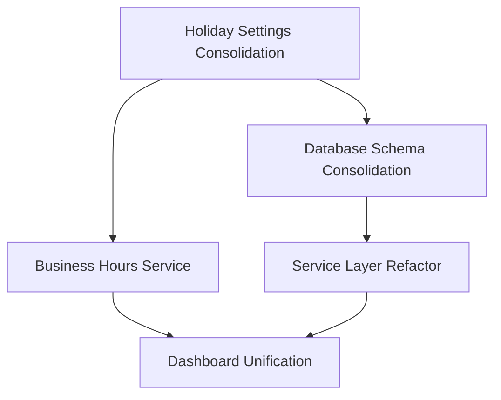
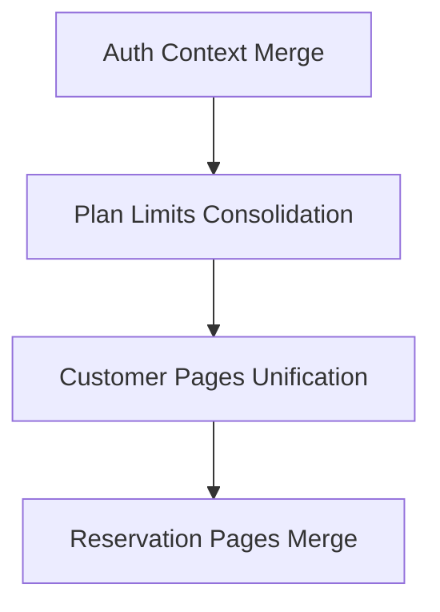
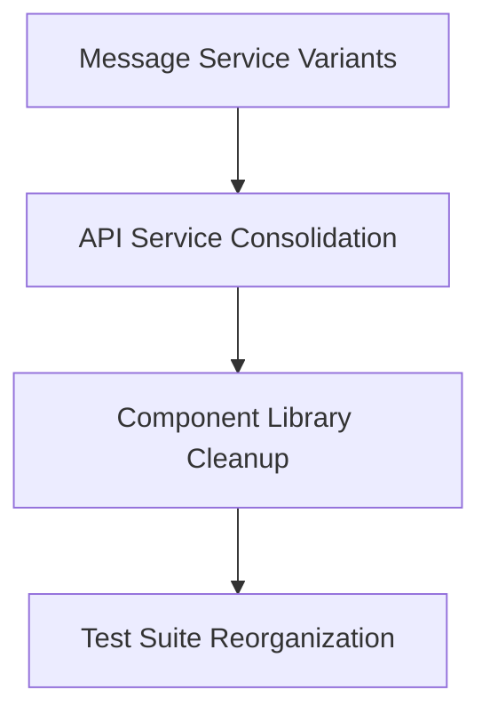

# 🗺️ Priority & Dependency Map for SMS Project Refactoring

## 🎯 Critical Path Analysis

### 🔴 Critical Priority (Must Do First)
These items block other improvements and have highest user impact.



### 🟡 High Priority (Do Next)
Important for code quality but not blocking critical features.



### 🟢 Medium Priority (Can Wait)
Nice to have improvements that enhance developer experience.



## 📊 Detailed Dependency Matrix

| Component | Dependencies | Blocked By | Blocks | Risk Level |
|-----------|--------------|------------|---------|------------|
| Holiday Settings | Database Schema | None | Business Hours, Reservations | 🔴 High |
| Database Schema | None | None | All Services | 🔴 High |
| Dashboard Variants | Service Layer, Auth | Holiday Settings | None | 🟡 Medium |
| Business Hours | Holiday Settings | Database Schema | Reservations | 🔴 High |
| Auth Context | None | None | All Protected Routes | 🟡 Medium |
| Service Layer | Database Schema | None | All Features | 🔴 High |
| Customer Pages | Auth Context | Service Layer | None | 🟢 Low |
| Reservation Pages | Business Hours | Holiday Settings | None | 🟡 Medium |

## 🚀 Implementation Sequence

### Week 1: Foundation
```bash
Day 1-2: Database Schema Analysis & Planning
  ├── Inventory all migrations
  ├── Create consolidated schema design
  └── Prepare rollback procedures

Day 3-4: Holiday Settings Consolidation
  ├── Implement unified holiday table
  ├── Create migration scripts
  └── Test with sample data

Day 5: Business Hours Service
  ├── Merge service variants
  ├── Update holiday integration
  └── Test all time-based features
```

### Week 2: Core Services
```bash
Day 6-7: Service Layer Architecture
  ├── Create service interfaces
  ├── Implement service registry
  └── Update dependency injection

Day 8-9: Authentication Consolidation
  ├── Merge Auth contexts
  ├── Implement safe mode features
  └── Test all auth flows

Day 10: Plan Limits Integration
  ├── Consolidate limit checking
  ├── Update usage tracking
  └── Test limit enforcement
```

### Week 3: UI Consolidation
```bash
Day 11-12: Dashboard Unification
  ├── Extract variant logic
  ├── Implement feature flags
  └── Test all dashboard modes

Day 13-14: Customer Pages
  ├── Merge page variants
  ├── Preserve all features
  └── Update routing

Day 15: Reservation Pages
  ├── Consolidate calendar views
  ├── Merge booking logic
  └── Test all workflows
```

## 🎨 Feature Preservation Matrix

### Dashboard Variants
| Variant | Key Features | Preserve Method | Testing Priority |
|---------|--------------|-----------------|------------------|
| Default | Full features | Base implementation | 🔴 Critical |
| Debug | Dev tools, logs | Feature flag | 🟡 High |
| Safe | Error boundaries | Strategy pattern | 🔴 Critical |
| Emergency | Minimal deps | Separate bundle | 🟡 High |
| Minimal | Basic UI only | Component flags | 🟢 Medium |
| Fixed | Static layout | Layout variant | 🟢 Medium |
| Simple | Reduced features | Feature toggle | 🟢 Medium |
| WithDebug | Prod + debug | Composite mode | 🟡 High |

### Service Variants
| Service | Variants | Consolidation Strategy | Risk |
|---------|----------|----------------------|------|
| Business Hours | Default, Fixed, Mock | Interface + Factory | 🟢 Low |
| Auth | Standard, Safe | Strategy Pattern | 🟡 Medium |
| Plan Limits | Standard, Safe | Error Handling Modes | 🟢 Low |
| Messages | Multiple APIs | Adapter Pattern | 🟡 Medium |

## 🔧 Technical Dependencies

### Database Layer
```yaml
Core Tables:
  tenants: 
    - No dependencies
    - Used by: ALL
  
  customers:
    - Depends on: tenants
    - Used by: reservations, messages, treatments
  
  holiday_settings:
    - Depends on: tenants
    - Used by: business_hours, reservations

Service Layer:
  SupabaseClient:
    - Used by: ALL services
    - Critical for: Auth, Realtime
  
  BusinessHoursService:
    - Depends on: HolidayService
    - Used by: ReservationService
```

### Component Layer
```yaml
Contexts:
  AuthContext:
    - Dependencies: supabase
    - Provides: user, session
    - Used by: ALL pages
  
  PlanLimitsContext:
    - Dependencies: AuthContext
    - Provides: limits, usage
    - Used by: Dashboard, Settings

Hooks:
  useCustomers:
    - Dependencies: AuthContext, supabase
    - Used by: Customer pages, Dashboard
  
  useReservations:
    - Dependencies: BusinessHours, Holidays
    - Used by: Calendar, Dashboard
```

## 🚦 Risk Mitigation Strategies

### High Risk Areas
1. **Holiday Settings**
   - Risk: Data loss during migration
   - Mitigation: Comprehensive backups, staged rollout
   - Rollback: Instant via backup restore

2. **Database Schema**
   - Risk: Breaking changes
   - Mitigation: Use views for compatibility
   - Rollback: Transaction-based migrations

3. **Authentication**
   - Risk: Users locked out
   - Mitigation: Gradual migration, feature flags
   - Rollback: Dual-mode support

### Medium Risk Areas
1. **Dashboard Consolidation**
   - Risk: Missing features
   - Mitigation: Feature parity tests
   - Rollback: Keep original files

2. **Service Layer**
   - Risk: API incompatibility
   - Mitigation: Interface-based design
   - Rollback: Service registry swap

## 📈 Progress Tracking

### Phase 1 Checklist (Foundation)
- [ ] Database schema mapped
- [ ] Holiday settings unified
- [ ] Business hours consolidated
- [ ] Service interfaces created
- [ ] Rollback procedures tested

### Phase 2 Checklist (Services)
- [ ] Auth contexts merged
- [ ] Plan limits consolidated
- [ ] Service registry implemented
- [ ] All hooks updated
- [ ] Integration tests passing

### Phase 3 Checklist (UI)
- [ ] Dashboard variants unified
- [ ] Customer pages merged
- [ ] Reservation pages consolidated
- [ ] All routes working
- [ ] Performance validated

## 🎯 Success Criteria

### Technical Success
- ✅ Zero data loss
- ✅ All features preserved
- ✅ No performance degradation
- ✅ 40-60% code reduction
- ✅ Improved maintainability

### Business Success
- ✅ No user disruption
- ✅ Faster feature delivery
- ✅ Reduced bug count
- ✅ Easier onboarding
- ✅ Lower maintenance cost

## 🔄 Continuous Validation

### Daily Checks
```bash
# Run every morning
npm run test:feature-parity
npm run test:performance
npm run validate:migrations
```

### Weekly Reviews
- Code coverage report
- Performance benchmarks
- Error rate analysis
- User feedback review
- Progress assessment

This priority map ensures safe, systematic refactoring while preserving all functionality and minimizing risk.