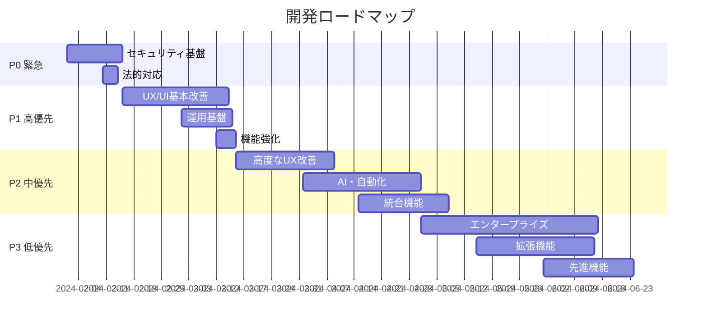

# 📊 開発優先度マトリックス

## 🎯 優先度判定基準

### 評価軸
1. **ビジネスインパクト** (40%)
2. **技術的リスク** (30%)
3. **実装難易度** (20%)
4. **投資対効果** (10%)

### 優先度レベル
- 🔴 **P0**: 緊急必須（1-2週間）
- 🟡 **P1**: 高優先（1ヶ月以内）
- 🟢 **P2**: 中優先（3ヶ月以内）
- 🔵 **P3**: 低優先（6ヶ月以内）

---

## 🔴 P0: 緊急必須項目（予算: 45万円）

### 1. セキュリティ基盤
| 項目 | 工数 | 予算 | インパクト | 担当 |
|------|------|------|------------|------|
| HTTPS強制実装 | 2日 | 5万円 | システム全体 | インフラ |
| 監査ログ実装 | 3日 | 8万円 | コンプライアンス | バックエンド |
| 自動バックアップ | 3日 | 8万円 | 事業継続性 | インフラ |
| セッション管理強化 | 2日 | 5万円 | 不正アクセス防止 | バックエンド |
| 個人情報暗号化 | 5日 | 12万円 | 情報漏洩対策 | バックエンド |

### 2. 法的対応
| 項目 | 工数 | 予算 | インパクト | 担当 |
|------|------|------|------------|------|
| 同意管理機能 | 2日 | 5万円 | 法令遵守 | フルスタック |
| データ削除機能 | 1日 | 2万円 | GDPR対応 | バックエンド |

**P0合計: 18日 / 45万円**

---

## 🟡 P1: 高優先項目（予算: 120万円）

### 1. UX/UI基本改善
| 項目 | 工数 | 予算 | インパクト | 担当 |
|------|------|------|------------|------|
| SPAルーター実装 | 5日 | 15万円 | ユーザビリティ | フロントエンド |
| デザインシステム | 7日 | 20万円 | ブランド統一 | UI/UX |
| コンポーネント化 | 10日 | 25万円 | 開発効率 | フロントエンド |
| モバイル基本対応 | 5日 | 12万円 | 利用率向上 | フロントエンド |

### 2. 運用基盤
| 項目 | 工数 | 予算 | インパクト | 担当 |
|------|------|------|------------|------|
| エラー監視 | 3日 | 8万円 | 障害対応 | DevOps |
| 基本モニタリング | 5日 | 12万円 | 稼働率向上 | DevOps |
| CI/CD整備 | 5日 | 15万円 | リリース品質 | DevOps |

### 3. 機能強化
| 項目 | 工数 | 予算 | インパクト | 担当 |
|------|------|------|------------|------|
| 2要素認証 | 3日 | 8万円 | セキュリティ | バックエンド |
| SMS配信最適化 | 2日 | 5万円 | コスト削減 | バックエンド |

**P1合計: 45日 / 120万円**

---

## 🟢 P2: 中優先項目（予算: 200万円）

### 1. 高度なUX改善
| 項目 | 工数 | 予算 | インパクト | 担当 |
|------|------|------|------------|------|
| PWA完全対応 | 10日 | 30万円 | エンゲージメント | フロントエンド |
| アニメーション | 5日 | 12万円 | 体感品質 | フロントエンド |
| ダークモード | 3日 | 8万円 | ユーザー満足度 | フロントエンド |
| アクセシビリティ | 7日 | 18万円 | 利用者拡大 | フロントエンド |

### 2. AI・自動化
| 項目 | 工数 | 予算 | インパクト | 担当 |
|------|------|------|------------|------|
| 予約最適化AI | 15日 | 40万円 | 売上向上 | AI/ML |
| 自動リマインダー | 5日 | 12万円 | No-show削減 | バックエンド |
| 顧客行動分析 | 10日 | 25万円 | マーケティング | データ分析 |

### 3. 統合機能
| 項目 | 工数 | 予算 | インパクト | 担当 |
|------|------|------|------------|------|
| LINE連携 | 8日 | 20万円 | リーチ拡大 | バックエンド |
| カレンダー同期 | 5日 | 12万円 | 利便性向上 | バックエンド |
| 決済連携 | 10日 | 25万円 | キャッシュフロー | バックエンド |

**P2合計: 78日 / 202万円**

---

## 🔵 P3: 低優先項目（予算: 235万円）

### 1. エンタープライズ機能
| 項目 | 工数 | 予算 | インパクト | 担当 |
|------|------|------|------------|------|
| マルチテナント完全対応 | 20日 | 60万円 | スケール対応 | アーキテクト |
| ホワイトラベル | 10日 | 25万円 | OEM展開 | フルスタック |
| 高度な分析機能 | 15日 | 40万円 | 経営判断 | データ分析 |

### 2. 拡張機能
| 項目 | 工数 | 予算 | インパクト | 担当 |
|------|------|------|------------|------|
| POS連携 | 10日 | 30万円 | 業務統合 | インテグレーション |
| 会計ソフト連携 | 8日 | 20万円 | 経理効率化 | インテグレーション |
| Instagram予約 | 12日 | 30万円 | 集客強化 | フルスタック |

### 3. 先進機能
| 項目 | 工数 | 予算 | インパクト | 担当 |
|------|------|------|------------|------|
| AIチャットボット | 15日 | 35万円 | 自動応対 | AI/ML |
| 売上予測 | 8日 | 20万円 | 経営支援 | データ分析 |

**P3合計: 98日 / 260万円**

---

## 📈 実装ロードマップ

### 月次スケジュール

---

## 💼 リソース配分

### チーム構成（推奨）
| 役割 | 人数 | 月額 | 主な担当 |
|------|------|------|----------|
| プロダクトマネージャー | 1名 | 80万円 | 全体統括 |
| バックエンドエンジニア | 2名 | 140万円 | API・DB |
| フロントエンドエンジニア | 2名 | 140万円 | UI/UX |
| DevOpsエンジニア | 1名 | 70万円 | インフラ |
| QAエンジニア | 1名 | 50万円 | 品質保証 |
| **合計** | **7名** | **480万円/月** | |

### 外部リソース
| 項目 | 予算/月 | 用途 |
|------|---------|------|
| UI/UXデザイナー | 30万円 | デザイン |
| セキュリティコンサル | 20万円 | 監査 |
| 法務アドバイザー | 10万円 | コンプライアンス |

---

## 🎯 成功基準

### Phase完了条件

#### P0完了（2週間後）
- [ ] セキュリティスコア: 85/100
- [ ] 全データ暗号化完了
- [ ] 法的要件100%充足

#### P1完了（1.5ヶ月後）
- [ ] ページロード: <2秒
- [ ] モバイル利用率: 40%
- [ ] エラー率: <0.1%

#### P2完了（4ヶ月後）
- [ ] 顧客満足度: 4.0/5.0
- [ ] 自動化率: 60%
- [ ] 統合システム数: 3+

#### P3完了（6ヶ月後）
- [ ] マルチテナント: 10社
- [ ] 月間収益: 500万円
- [ ] 拡張機能利用率: 30%

---

## ⚡ クイックウィン項目

### 1週間で実装可能（即効性高）
1. **セッションタイムアウト** - 2時間
2. **CSPヘッダー追加** - 1時間
3. **エラーログ改善** - 4時間
4. **基本的な入力検証強化** - 6時間
5. **レスポンシブ修正** - 8時間

### ROI最大項目
1. **自動バックアップ** - 投資8万円 → 損失回避500万円/年
2. **2要素認証** - 投資8万円 → セキュリティ事故防止
3. **SMS最適化** - 投資5万円 → コスト削減20万円/月

---

## 📝 実装時の注意事項

### アーキテクチャ原則
1. **マイクロサービス**を意識した設計
2. **API First**アプローチ
3. **イベント駆動**アーキテクチャ
4. **DDD**の段階的導入

### 品質基準
- コードカバレッジ: 80%以上
- パフォーマンステスト: 全API
- セキュリティテスト: 四半期ごと
- ユーザビリティテスト: 機能追加時

### リスク管理
- 機能フラグによる段階リリース
- カナリアデプロイメント
- 自動ロールバック機能
- A/Bテストの活用

この優先度マトリックスに従って開発を進めることで、限られたリソースで最大の効果を得ることができます。