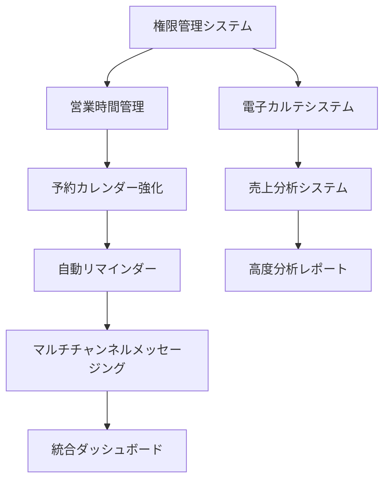

# SMS美容室管理システム 開発スケジュール・依存関係分析

## 1. 実装優先度マトリックス

### 1.1 ビジネス価値 vs 技術複雑度分析

```
高ビジネス価値 ─────────────────────────────────────────
│                                                   │
│   🔴 電子カルテ      🟡 マルチチャンネル          │
│   (Phase 2)         メッセージング                │
│                     (Phase 3)                     │
│                                                   │
│   🟢 予約カレンダー  🟢 自動リマインダー          │  
│   強化 (Phase 1)     (Phase 1)                   │
│                                                   │
│   🟡 営業時間管理    🔴 売上分析システム          │
│   (Phase 2)         (Phase 3)                     │
│                                                   │
│   🟢 権限管理        🔵 パフォーマンス            │
│   (Phase 1)         最適化 (Phase 4)              │
│                                                   │
低複雑度 ──────────────────────────── 高複雑度
```

**凡例:**
- 🟢 Phase 1: 即座に実装可能（1-2週間）
- 🟡 Phase 2: 中期実装（3-4週間）  
- 🔴 Phase 3: 長期実装（5-8週間）
- 🔵 Phase 4: 最適化・拡張（継続的）

## 2. フェーズ別実装計画

### Phase 1: 基盤強化 (週1-2: 2週間)

#### Week 1: コア機能拡張
**目標**: 既存システムの基盤強化

**実装項目**:
1. **権限管理システム** (3日)
   - RBAC実装
   - ユーザーロール定義
   - 権限チェックミドルウェア

2. **自動リマインダーシステム基盤** (2日)
   - node-cron設定
   - 基本テンプレートシステム
   - 配信履歴管理

**技術タスク**:
```javascript
// 実装ファイル
app/backend/middleware/rbac.js
app/backend/services/ReminderScheduler.js
app/backend/controllers/permissions.js
```

#### Week 2: カレンダー・営業時間
**目標**: 予約システム強化

**実装項目**:
1. **予約カレンダー機能強化** (4日)
   - 日/週/月表示切り替え
   - 営業時間連動
   - グレーアウト表示

2. **営業時間管理** (3日)
   - 定休日設定
   - 特別営業日管理
   - 営業時間API

**技術タスク**:
```javascript
// 実装ファイル
app/frontend/js/calendar-enhanced.js
app/backend/models/BusinessHours.js
app/backend/controllers/scheduling.js
```

### Phase 2: 中核機能実装 (週3-6: 4週間)

#### Week 3-4: 電子カルテシステム
**目標**: 医療記録管理の完全実装

**実装項目**:
1. **カルテデータモデル設計** (2日)
   - Firebase Collection設計
   - データ暗号化実装
   - バックアップシステム

2. **カルテUI実装** (5日)
   - 施術記録入力フォーム
   - 写真アップロード機能
   - 履歴表示システム

3. **検索・フィルター機能** (3日)
   - 高速検索インデックス
   - 条件別フィルタリング
   - エクスポート機能

**技術タスク**:
```javascript
// 実装ファイル
app/backend/models/MedicalRecord.js
app/frontend/js/medical-records/
app/backend/controllers/medical-records.js
app/backend/services/ImageProcessor.js
```

#### Week 5-6: 営業時間・スケジュール管理
**目標**: 完全な時間管理システム

**実装項目**:
1. **複雑スケジュール対応** (4日)
   - 季節営業対応
   - 不定期休日管理
   - スタッフ別営業時間

2. **予約最適化エンジン** (3日)
   - 空き時間自動検索
   - ダブルブッキング防止
   - 待機リスト管理

3. **統合テスト** (3日)
   - E2Eテスト実装
   - パフォーマンステスト
   - セキュリティテスト

### Phase 3: 高度機能実装 (週7-14: 8週間)

#### Week 7-10: マルチチャンネルメッセージング
**目標**: 統合メッセージングシステム

**Week 7-8: 基盤構築**
1. **メッセージングアーキテクチャ** (5日)
   - Redis Queue設定
   - メッセージルーター実装
   - 統一API設計

2. **チャンネル統合** (5日)
   - LINE Bot拡張
   - Instagram API統合
   - SMS/Twilio強化

**Week 9-10: 高度機能**
1. **優先度判定エンジン** (4日)
   - 顧客設定管理
   - 履歴分析アルゴリズム
   - 自動チャンネル選択

2. **統合UI実装** (6日)
   - マルチチャンネル管理画面
   - 会話履歴統合表示
   - 一括配信システム

**技術タスク**:
```javascript
// 実装ファイル  
app/backend/services/MessageRouter.js
app/backend/controllers/messaging/
app/frontend/js/messaging/unified-interface.js
config/redis.js
config/webhooks.js
```

#### Week 11-14: 売上分析システム
**目標**: ビジネスインテリジェンス実装

**Week 11-12: 分析エンジン**
1. **データ収集システム** (5日)
   - トランザクション記録
   - リアルタイム集計
   - データウェアハウス設計

2. **分析アルゴリズム** (5日)
   - スタッフパフォーマンス分析
   - 収益性分析
   - トレンド分析

**Week 13-14: レポートシステム**
1. **レポートジェネレータ** (4日)
   - 自動レポート生成
   - カスタムダッシュボード
   - エクスポート機能

2. **可視化システム** (6日)
   - Chart.js統合
   - インタラクティブグラフ
   - リアルタイム更新

**技術タスク**:
```javascript
// 実装ファイル
app/backend/services/AnalyticsEngine.js
app/backend/controllers/analytics/
app/frontend/js/analytics/dashboard.js
app/backend/jobs/data-aggregation.js
```

### Phase 4: 最適化・拡張 (週15-: 継続的)

#### 継続的改善項目
1. **パフォーマンス最適化**
   - データベースインデックス最適化
   - キャッシュ戦略実装
   - CDN設定

2. **モバイル最適化**
   - レスポンシブデザイン改善
   - PWA機能実装
   - オフライン対応

3. **セキュリティ強化**
   - ペネトレーションテスト
   - GDPR完全対応
   - 監査ログ強化

## 3. 技術的依存関係分析

### 3.1 Critical Path (クリティカルパス)



### 3.2 技術的依存関係

#### データベース依存関係
```javascript
// 必要なFirebase Collection設計順序
1. users, roles → permissions (権限管理)
2. business_hours → appointments (営業時間 → 予約)
3. customers → medical_records (顧客 → カルテ)
4. appointments → analytics_data (予約 → 分析)
5. channels → unified_messages (チャンネル → メッセージング)
```

#### API依存関係
```javascript
// API実装順序
1. /api/auth/roles (権限管理)
2. /api/business-hours (営業時間)
3. /api/appointments/enhanced (予約強化)
4. /api/medical-records (電子カルテ)
5. /api/messages/unified (統合メッセージング)
6. /api/analytics (分析システム)
```

## 4. リスク分析・対策

### 4.1 高リスク項目

#### 技術リスク
1. **Instagram API制限**
   - **リスク**: API制限・仕様変更
   - **対策**: 代替手段準備、段階的実装

2. **Firebase Firestore制限**
   - **リスク**: 大量データ処理の制限
   - **対策**: データ分割戦略、インデックス最適化

3. **リアルタイム処理**
   - **リスク**: Socket.io接続数制限
   - **対策**: Redis Adapter使用、負荷分散

#### ビジネスリスク
1. **データ移行**
   - **リスク**: 既存データ破損
   - **対策**: 段階的移行、完全バックアップ

2. **ユーザートレーニング**
   - **リスク**: 新機能の理解不足
   - **対策**: 段階的リリース、マニュアル作成

### 4.2 リスク軽減戦略

#### 技術的軽減策
```javascript
// 実装例: Graceful Degradation
const sendMessage = async (message, channels) => {
  const results = {};
  
  // 優先度順で送信試行
  for (const channel of channels) {
    try {
      results[channel] = await sendToChannel(channel, message);
      if (results[channel].success) break; // 成功したら停止
    } catch (error) {
      console.warn(`${channel} failed, trying next channel`);
      results[channel] = { success: false, error: error.message };
    }
  }
  
  return results;
};
```

#### プロジェクト管理軽減策
1. **段階的リリース**: 機能別デプロイメント
2. **A/Bテスト**: 新機能の段階的展開
3. **ロールバック戦略**: 即座に前バージョンに戻せる設計

## 5. 品質保証計画

### 5.1 テスト戦略

#### Unit Testing (単体テスト)
```javascript
// テスト実装例
describe('MessageRouter', () => {
  test('優先度に基づいてチャンネル選択', async () => {
    const router = new MessageRouter();
    const customer = { preferences: { primary: 'line' } };
    const channel = await router.selectChannel(customer);
    expect(channel).toBe('line');
  });
});
```

#### Integration Testing (統合テスト)
```javascript
// API統合テスト
describe('Medical Records API', () => {
  test('カルテ作成から取得まで', async () => {
    const record = await createMedicalRecord(testData);
    expect(record.id).toBeDefined();
    
    const retrieved = await getMedicalRecord(record.id);
    expect(retrieved.customerId).toBe(testData.customerId);
  });
});
```

### 5.2 品質メトリクス

#### コード品質指標
- **テストカバレッジ**: 80%以上
- **Cyclomatic Complexity**: 10以下
- **Code Duplication**: 5%以下
- **Technical Debt Ratio**: 5%以下

#### パフォーマンス指標
- **API Response Time**: 95%ile < 500ms
- **Page Load Time**: < 3秒
- **Database Query Time**: < 100ms
- **Memory Usage**: < 512MB

## 6. デプロイメント計画

### 6.1 環境構成

```yaml
# 環境別設定
environments:
  development:
    database: firebase-dev
    redis: localhost:6379
    features: all-enabled
    
  staging:
    database: firebase-staging  
    redis: redis-staging
    features: phase-based-rollout
    
  production:
    database: firebase-prod
    redis: redis-cluster
    features: gradual-rollout
```

### 6.2 デプロイメント戦略

#### Blue-Green デプロイメント
```javascript
// デプロイメント設定
const deployConfig = {
  strategy: 'blue-green',
  healthCheck: '/api/health',
  rollback: {
    automatic: true,
    threshold: '5% error rate',
    timeout: '5 minutes'
  },
  monitoring: {
    metrics: ['response_time', 'error_rate', 'memory_usage'],
    alerts: ['slack', 'email']
  }
};
```

## 7. 運用・保守計画

### 7.1 監視計画

#### アプリケーション監視
```javascript
// 監視項目
const monitoring = {
  system: {
    cpu: 'threshold: 80%',
    memory: 'threshold: 85%', 
    disk: 'threshold: 90%'
  },
  application: {
    response_time: '95%ile < 500ms',
    error_rate: '< 1%',
    throughput: 'baseline ± 20%'
  },
  business: {
    message_delivery: '> 99%',
    appointment_booking: '> 99.5%',
    payment_processing: '> 99.9%'
  }
};
```

### 7.2 保守計画

#### 定期メンテナンス
1. **毎日**: ログローテーション、バックアップ確認
2. **毎週**: セキュリティアップデート確認
3. **毎月**: パフォーマンス分析、容量計画見直し
4. **四半期**: システム全体レビュー、拡張計画策定

## 8. 成功指標・KPI

### 8.1 技術的KPI
- **システム可用性**: 99.9%
- **平均応答時間**: < 300ms
- **エラー率**: < 0.1%
- **デプロイメント頻度**: 週1回以上

### 8.2 ビジネスKPI
- **予約処理効率**: 50%向上
- **顧客満足度**: 4.5/5.0以上
- **スタッフ業務効率**: 30%向上
- **売上可視性**: リアルタイム対応

この実装計画により、段階的かつ確実にシステム拡張を進めることができ、各フェーズでの価値提供を確保しながら、技術的リスクを最小限に抑えた開発が可能になります。