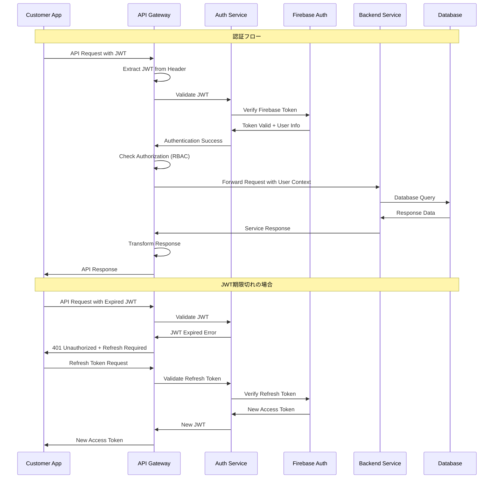

# API Gateway・セキュリティ境界設計書

## 1. API Gateway概要

### 1.1 設計方針
顧客向けアプリと既存の美容室管理システムの間に位置するAPI Gatewayを構築し、セキュリティ・パフォーマンス・運用性を統合的に管理する。

### 1.2 主要責務
- **認証・認可**: 顧客アプリからのアクセス制御
- **トラフィック管理**: レート制限・負荷分散
- **データ変換**: 内部APIと外部APIの差分吸収
- **セキュリティ**: 脅威検知・防御
- **監視・ロギング**: アクセス追跡・性能監視

## 2. アーキテクチャ設計

### 2.1 全体構成

```
┌─────────────────────────────────────────────────────────────┐
│                     外部からのアクセス                       │
├─────────────────────────────────────────────────────────────┤
│                                                             │
│  ┌─────────────┐    ┌──────────────┐    ┌─────────────────┐ │
│  │顧客PWAアプリ  │    │モバイルアプリ   │    │サードパーティ    │ │
│  │(React)      │    │(iOS/Android) │    │統合             │ │
│  └─────────────┘    └──────────────┘    └─────────────────┘ │
│         │                   │                      │        │
│         └───────────────────┼──────────────────────┘        │
│                             │                               │
│                    ┌────────▼────────┐                     │
│                    │   CloudFlare    │                     │
│                    │   WAF + CDN     │                     │
│                    └─────────────────┘                     │
│                             │                               │
│                    ┌────────▼────────┐                     │
│                    │  API Gateway    │                     │
│                    │  (Express.js)   │                     │
│                    │                 │                     │
│                    │ ┌─────────────┐ │                     │
│                    │ │Authentication│ │                     │
│                    │ │  & Authorization│                   │
│                    │ └─────────────┘ │                     │
│                    │ ┌─────────────┐ │                     │
│                    │ │Rate Limiting│ │                     │
│                    │ │& Throttling │ │                     │
│                    │ └─────────────┘ │                     │
│                    │ ┌─────────────┐ │                     │
│                    │ │Request/Response│                    │
│                    │ │Transformation│ │                     │
│                    │ └─────────────┘ │                     │
│                    │ ┌─────────────┐ │                     │
│                    │ │  Logging &  │ │                     │
│                    │ │  Monitoring │ │                     │
│                    │ └─────────────┘ │                     │
│                    └─────────────────┘                     │
│                             │                               │
│     ┌───────────────────────┼───────────────────────────┐   │
│     │                       │                           │   │
│ ┌───▼────┐  ┌──────▼──────┐  ┌───▼────┐  ┌──────▼──────┐ │
│ │Customer│  │Appointment  │  │Message │  │Analytics    │ │
│ │Service │  │Service      │  │Service │  │Service      │ │
│ └────────┘  └─────────────┘  └────────┘  └─────────────┘ │
│     │              │              │             │        │
│     └──────────────┼──────────────┼─────────────┘        │
│                    │              │                      │
│              ┌─────┴──────────────┴─────┐                │
│              │Backend Services         │                │
│              │- Firebase/Firestore     │                │
│              │- PostgreSQL/Sequelize   │                │
│              │- External APIs          │                │
│              └─────────────────────────┘                │
└─────────────────────────────────────────────────────────────┘
```

### 2.2 レイヤー設計

```javascript
const APIGatewayLayers = {
  // Layer 1: エッジレイヤー（CDN/WAF）
  edge_layer: {
    provider: 'CloudFlare',
    responsibilities: [
      'DDoS攻撃防御',
      'Bot攻撃検知・ブロック',
      '静的コンテンツキャッシュ',
      'SSL終端',
      'ジオブロッキング'
    ],
    rules: {
      rate_limiting: '100 req/sec per IP',
      geo_blocking: ['CN', 'RU'], // 例：高リスク国からのブロック
      bot_protection: 'enabled',
      ssl_mode: 'full_strict'
    }
  },

  // Layer 2: APIゲートウェイ
  gateway_layer: {
    framework: 'Express.js',
    middleware: [
      'helmet', // セキュリティヘッダー
      'cors',   // CORS設定
      'compression', // gzip圧縮
      'morgan', // アクセスログ
      'express-rate-limit', // レート制限
      'express-validator'   // 入力検証
    ],
    responsibilities: [
      'API認証・認可',
      'レート制限・スロットリング',
      'リクエスト・レスポンス変換',
      'ルーティング',
      'エラーハンドリング',
      'ログ出力・メトリクス収集'
    ]
  },

  // Layer 3: サービスレイヤー
  service_layer: {
    pattern: 'Microservices',
    services: {
      customer_service: {
        port: 3001,
        health_check: '/health',
        endpoints: ['/profile', '/preferences', '/history']
      },
      appointment_service: {
        port: 3002,
        health_check: '/health',
        endpoints: ['/appointments', '/availability', '/booking']
      },
      notification_service: {
        port: 3003,
        health_check: '/health',
        endpoints: ['/messages', '/push', '/sms']
      }
    }
  },

  // Layer 4: データレイヤー
  data_layer: {
    primary_db: 'Firebase Firestore',
    secondary_db: 'PostgreSQL',
    cache: 'Redis',
    storage: 'Firebase Storage',
    search: 'Elasticsearch (将来)'
  }
};
```

## 3. 認証・認可システム

### 3.1 認証フロー



### 3.2 認証ミドルウェア実装

```javascript
// JWT認証ミドルウェア
const authenticateJWT = async (req, res, next) => {
  try {
    // Authorizationヘッダーからトークン抽出
    const authHeader = req.headers.authorization;
    if (!authHeader || !authHeader.startsWith('Bearer ')) {
      return res.status(401).json({
        error: 'MISSING_TOKEN',
        message: 'アクセストークンが必要です'
      });
    }

    const token = authHeader.substring(7);

    // Firebase Admin SDKでトークン検証
    const decodedToken = await admin.auth().verifyIdToken(token);
    
    // ユーザー情報を取得
    const customer = await Customer.findOne({
      firebase_uid: decodedToken.uid
    });

    if (!customer || !customer.is_active) {
      return res.status(401).json({
        error: 'USER_INACTIVE',
        message: 'アカウントが無効です'
      });
    }

    // リクエストオブジェクトにユーザー情報を追加
    req.user = {
      uid: decodedToken.uid,
      customer_id: customer.id,
      email: decodedToken.email,
      phone: decodedToken.phone_number,
      verified: decodedToken.email_verified || decodedToken.phone_verified
    };

    // 最終ログイン時刻更新
    await updateLastLogin(customer.id);

    next();
  } catch (error) {
    console.error('JWT Authentication Error:', error);
    
    if (error.code === 'auth/id-token-expired') {
      return res.status(401).json({
        error: 'TOKEN_EXPIRED',
        message: 'トークンの有効期限が切れています'
      });
    }

    return res.status(401).json({
      error: 'INVALID_TOKEN',
      message: 'トークンが無効です'
    });
  }
};

// 認可ミドルウェア（RBAC）
const authorize = (permissions = []) => {
  return async (req, res, next) => {
    try {
      const { customer_id } = req.user;
      
      // 顧客の権限を取得
      const customerPermissions = await getCustomerPermissions(customer_id);
      
      // 必要な権限をチェック
      const hasPermission = permissions.every(permission => 
        customerPermissions.includes(permission)
      );

      if (!hasPermission) {
        return res.status(403).json({
          error: 'INSUFFICIENT_PERMISSIONS',
          message: 'この操作を行う権限がありません',
          required_permissions: permissions
        });
      }

      next();
    } catch (error) {
      console.error('Authorization Error:', error);
      return res.status(500).json({
        error: 'AUTHORIZATION_ERROR',
        message: '権限確認中にエラーが発生しました'
      });
    }
  };
};

// 使用例
app.get('/api/v1/customer/profile', 
  authenticateJWT,
  authorize(['read:own_profile']),
  getCustomerProfile
);

app.put('/api/v1/customer/profile',
  authenticateJWT, 
  authorize(['update:own_profile']),
  updateCustomerProfile
);
```

### 3.3 権限管理システム

```javascript
const PermissionSystem = {
  // 顧客権限定義
  customer_permissions: {
    // プロフィール関連
    'read:own_profile': '自分のプロフィール閲覧',
    'update:own_profile': '自分のプロフィール更新',
    
    // 予約関連
    'read:own_appointments': '自分の予約閲覧',
    'create:appointments': '予約作成',
    'update:own_appointments': '自分の予約変更',
    'cancel:own_appointments': '自分の予約キャンセル',
    
    // 履歴関連
    'read:own_history': '自分の来店履歴閲覧',
    'read:own_photos': '自分の施術写真閲覧',
    
    // メッセージ関連
    'send:messages': 'メッセージ送信',
    'read:own_messages': '自分のメッセージ閲覧',
    
    // ポイント・特典関連
    'read:own_points': 'ポイント残高閲覧',
    'redeem:rewards': '特典交換'
  },

  // 権限グループ
  permission_groups: {
    basic_customer: [
      'read:own_profile',
      'read:own_appointments', 
      'read:own_history',
      'read:own_messages',
      'read:own_points'
    ],
    
    verified_customer: [
      ...this.basic_customer,
      'update:own_profile',
      'create:appointments',
      'update:own_appointments',
      'send:messages'
    ],
    
    premium_customer: [
      ...this.verified_customer,
      'cancel:own_appointments',
      'read:own_photos',
      'redeem:rewards'
    ]
  },

  // 動的権限チェック
  checkPermission: async (customerId, permission) => {
    const customer = await Customer.findById(customerId);
    const permissions = await getCustomerPermissions(customerId);
    
    return permissions.includes(permission);
  }
};
```

## 4. レート制限・スロットリング

### 4.1 レート制限戦略

```javascript
const RateLimitingStrategy = {
  // 層別レート制限
  layers: {
    // CloudFlareレベル（L4/DDoS対策）
    cloudflare: {
      requests_per_second: 100,
      burst_size: 200,
      scope: 'per_ip'
    },

    // API Gatewayレベル（L7/アプリケーション）
    api_gateway: {
      // 認証済みユーザー
      authenticated: {
        requests_per_minute: 300,
        requests_per_hour: 1000,
        scope: 'per_user'
      },
      
      // 未認証ユーザー
      unauthenticated: {
        requests_per_minute: 60,
        requests_per_hour: 200,  
        scope: 'per_ip'
      }
    },

    // エンドポイント別制限
    endpoint_specific: {
      // 認証エンドポイント（ブルートフォース対策）
      '/api/v1/auth/*': {
        requests_per_minute: 5,
        block_duration: 900, // 15分
        scope: 'per_ip'
      },
      
      // 予約作成（リソース保護）
      'POST /api/v1/appointments': {
        requests_per_minute: 10,
        scope: 'per_user'
      },
      
      // メッセージ送信（スパム対策）
      'POST /api/v1/messages': {
        requests_per_minute: 30,
        scope: 'per_user'
      }
    }
  }
};

// Express Rate Limit実装
const createRateLimiter = (options) => {
  return rateLimit({
    windowMs: options.windowMs,
    max: options.max,
    message: {
      error: 'RATE_LIMIT_EXCEEDED',
      message: 'リクエストが多すぎます。しばらく待ってから再試行してください。',
      retry_after: Math.ceil(options.windowMs / 1000)
    },
    standardHeaders: true,
    legacyHeaders: false,
    keyGenerator: options.keyGenerator || ((req) => req.ip),
    skip: options.skip || (() => false),
    onLimitReached: (req, res, options) => {
      console.warn(`Rate limit exceeded for ${req.ip}: ${req.originalUrl}`);
      // アラート送信（将来実装）
    }
  });
};

// 使用例
const generalLimiter = createRateLimiter({
  windowMs: 15 * 60 * 1000, // 15分
  max: 100, // 最大100リクエスト
  keyGenerator: (req) => req.user?.customer_id || req.ip
});

const authLimiter = createRateLimiter({
  windowMs: 15 * 60 * 1000,
  max: 5,
  keyGenerator: (req) => req.ip
});

app.use('/api/', generalLimiter);
app.use('/api/v1/auth/', authLimiter);
```

### 4.2 アダプティブスロットリング

```javascript
// サーキットブレーカーパターン
class CircuitBreaker {
  constructor(service, options = {}) {
    this.service = service;
    this.failureThreshold = options.failureThreshold || 5;
    this.recoveryTimeout = options.recoveryTimeout || 60000;
    this.monitoringTimeout = options.monitoringTimeout || 10000;
    
    this.state = 'CLOSED'; // CLOSED, OPEN, HALF_OPEN
    this.failureCount = 0;
    this.nextAttempt = null;
  }

  async call(request) {
    if (this.state === 'OPEN') {
      if (Date.now() < this.nextAttempt) {
        throw new Error('Circuit breaker is OPEN');
      }
      this.state = 'HALF_OPEN';
    }

    try {
      const result = await this.service(request);
      this.onSuccess();
      return result;
    } catch (error) {
      this.onFailure();
      throw error;
    }
  }

  onSuccess() {
    this.failureCount = 0;
    this.state = 'CLOSED';
  }

  onFailure() {
    this.failureCount += 1;
    
    if (this.failureCount >= this.failureThreshold) {
      this.state = 'OPEN';
      this.nextAttempt = Date.now() + this.recoveryTimeout;
    }
  }
}

// 使用例
const appointmentServiceBreaker = new CircuitBreaker(
  appointmentService.create,
  {
    failureThreshold: 3,
    recoveryTimeout: 30000
  }
);
```

## 5. セキュリティ境界・防御戦略

### 5.1 多層防御アーキテクチャ

```javascript
const SecurityLayers = {
  // Layer 1: ネットワークレベル
  network_security: {
    waf: 'CloudFlare WAF',
    ddos_protection: 'CloudFlare DDoS Protection',
    ssl_termination: 'CloudFlare SSL/TLS',
    ip_filtering: {
      whitelist: [], // VIP顧客IP
      blacklist: [], // 悪意のあるIP
      geo_blocking: ['CN', 'RU'] // 高リスク国
    }
  },

  // Layer 2: アプリケーションレベル
  application_security: {
    input_validation: 'Joi + express-validator',
    output_encoding: 'helmet + DOMPurify',
    sql_injection: 'Sequelize ORM',
    xss_protection: 'helmet XSS filter',
    csrf_protection: 'csurf middleware',
    content_security_policy: {
      default_src: ["'self'"],
      script_src: ["'self'", "'unsafe-inline'", 'https://apis.google.com'],
      style_src: ["'self'", "'unsafe-inline'"],
      img_src: ["'self'", 'data:', 'https:'],
      font_src: ["'self'", 'https://fonts.gstatic.com']
    }
  },

  // Layer 3: データレベル  
  data_security: {
    encryption_at_rest: 'Firebase native + AES-256',
    encryption_in_transit: 'TLS 1.3',
    data_classification: {
      public: ['service_info', 'business_hours'],
      internal: ['appointment_data', 'basic_profile'],
      confidential: ['personal_info', 'payment_data'],
      restricted: ['medical_info', 'private_notes']
    },
    access_control: 'RBAC + ABAC',
    data_masking: 'PII tokenization'
  }
};
```

### 5.2 脅威検知・対応システム

```javascript
const ThreatDetection = {
  // 異常検知ルール
  detection_rules: [
    {
      name: 'Brute Force Authentication',
      condition: 'failed_login_attempts > 5 in 15_minutes from same_ip',
      severity: 'HIGH',
      action: 'block_ip_temporary'
    },
    
    {
      name: 'Suspicious API Usage',
      condition: 'api_calls > 1000 in 1_hour from same_user',
      severity: 'MEDIUM', 
      action: 'rate_limit_aggressive'
    },
    
    {
      name: 'Geo-location Anomaly',
      condition: 'login_location != usual_location AND distance > 1000km',
      severity: 'MEDIUM',
      action: 'require_additional_auth'
    },
    
    {
      name: 'Data Exfiltration Attempt',
      condition: 'data_download > 100MB in 1_hour',
      severity: 'HIGH',
      action: 'block_user_temporary'
    }
  ],

  // 自動対応アクション
  response_actions: {
    block_ip_temporary: {
      duration: 3600, // 1時間
      scope: 'ip_address',
      notification: true
    },
    
    block_user_temporary: {
      duration: 1800, // 30分
      scope: 'user_account',
      notification: true
    },
    
    require_additional_auth: {
      method: 'sms_otp',
      bypass_conditions: ['trusted_device']
    },
    
    rate_limit_aggressive: {
      limit: '10_requests_per_minute',
      duration: 1800
    }
  }
};

// 脅威検知実装
class ThreatDetectionService {
  constructor() {
    this.redis = new Redis(process.env.REDIS_URL);
    this.rules = ThreatDetection.detection_rules;
  }

  async analyzeRequest(req) {
    const context = {
      ip: req.ip,
      user_id: req.user?.customer_id,
      endpoint: req.originalUrl,
      method: req.method,
      timestamp: Date.now(),
      user_agent: req.headers['user-agent']
    };

    for (const rule of this.rules) {
      const isTriggered = await this.evaluateRule(rule, context);
      
      if (isTriggered) {
        await this.triggerResponse(rule, context);
        
        // ログ出力
        console.warn(`Security rule triggered: ${rule.name}`, {
          context,
          rule: rule.name,
          severity: rule.severity
        });
        
        // 高重要度の場合は即座に処理を停止
        if (rule.severity === 'HIGH') {
          throw new SecurityError(rule.name, 'Request blocked by security policy');
        }
      }
    }
  }

  async evaluateRule(rule, context) {
    // ルール評価ロジック（簡略化）
    switch (rule.name) {
      case 'Brute Force Authentication':
        const failedAttempts = await this.getFailedLoginCount(context.ip);
        return failedAttempts > 5;
        
      case 'Suspicious API Usage':
        const apiCalls = await this.getApiCallCount(context.user_id);
        return apiCalls > 1000;
        
      default:
        return false;
    }
  }

  async triggerResponse(rule, context) {
    const action = ThreatDetection.response_actions[rule.action];
    
    if (!action) return;

    switch (rule.action) {
      case 'block_ip_temporary':
        await this.blockIP(context.ip, action.duration);
        break;
        
      case 'block_user_temporary':
        await this.blockUser(context.user_id, action.duration);
        break;
        
      case 'require_additional_auth':
        await this.flagForAdditionalAuth(context.user_id);
        break;
    }

    // 通知送信
    if (action.notification) {
      await this.sendSecurityAlert(rule, context);
    }
  }
}
```

## 6. ログ・監視・メトリクス

### 6.1 ログ管理戦略

```javascript
const LoggingStrategy = {
  // ログレベル定義
  log_levels: {
    ERROR: { priority: 0, retention: '2_years', alerting: true },
    WARN: { priority: 1, retention: '1_year', alerting: false },
    INFO: { priority: 2, retention: '90_days', alerting: false },
    DEBUG: { priority: 3, retention: '30_days', alerting: false }
  },

  // ログカテゴリ
  categories: {
    security: {
      events: ['login', 'logout', 'failed_auth', 'permission_denied'],
      retention: '7_years', // 法的要件
      pii_scrubbing: true
    },
    
    business: {
      events: ['appointment_created', 'payment_processed', 'user_registered'],
      retention: '5_years',
      analytics: true
    },
    
    technical: {
      events: ['api_error', 'db_error', 'performance_issue'],
      retention: '1_year',
      debugging: true
    },
    
    audit: {
      events: ['data_access', 'data_modification', 'admin_action'],
      retention: '7_years',
      immutable: true
    }
  },

  // ログ構造
  log_structure: {
    timestamp: 'ISO8601',
    level: 'string',
    category: 'string',
    event_type: 'string',
    correlation_id: 'uuid',
    user_id: 'uuid_or_null',
    session_id: 'uuid_or_null',
    ip_address: 'string',
    user_agent: 'string',
    request_id: 'uuid',
    endpoint: 'string',
    method: 'string',
    status_code: 'integer',
    response_time: 'integer_ms',
    error_details: 'object_or_null',
    custom_fields: 'object'
  }
};

// Winston Logger設定
const logger = winston.createLogger({
  format: winston.format.combine(
    winston.format.timestamp(),
    winston.format.errors({ stack: true }),
    winston.format.json(),
    winston.format.printf(info => {
      // PII情報のマスキング
      const masked = maskPII(info);
      return JSON.stringify(masked);
    })
  ),
  
  transports: [
    // コンソール出力（開発環境）
    new winston.transports.Console({
      level: process.env.NODE_ENV === 'development' ? 'debug' : 'info'
    }),
    
    // ファイル出力（本番環境）
    new winston.transports.File({
      filename: 'logs/error.log',
      level: 'error',
      maxsize: 50 * 1024 * 1024, // 50MB
      maxFiles: 10
    }),
    
    new winston.transports.File({
      filename: 'logs/combined.log',
      maxsize: 100 * 1024 * 1024, // 100MB
      maxFiles: 30
    }),
    
    // 外部ログサービス（本番環境）
    new winston.transports.Http({
      host: 'logs.datadoghq.com',
      port: 443,
      path: `/v1/input/${process.env.DATADOG_API_KEY}`,
      ssl: true
    })
  ]
});
```

### 6.2 メトリクス・監視

```javascript
const MonitoringMetrics = {
  // ビジネスメトリクス
  business_metrics: {
    user_registrations: 'counter',
    appointments_created: 'counter', 
    revenue_generated: 'gauge',
    customer_satisfaction: 'histogram',
    retention_rate: 'gauge'
  },

  // 技術メトリクス
  technical_metrics: {
    api_request_count: 'counter',
    api_response_time: 'histogram',
    api_error_rate: 'gauge',
    database_connection_pool: 'gauge',
    memory_usage: 'gauge',
    cpu_usage: 'gauge'
  },

  // セキュリティメトリクス
  security_metrics: {
    failed_login_attempts: 'counter',
    blocked_ips: 'counter',
    security_events: 'counter',
    csrf_attacks: 'counter'
  },

  // SLI/SLO定義
  service_level_indicators: {
    availability: {
      measurement: 'uptime_percentage',
      target: '99.9%',
      window: 'monthly'
    },
    
    response_time: {
      measurement: 'p95_response_time',
      target: '<200ms',
      window: 'hourly'
    },
    
    error_rate: {
      measurement: 'error_percentage',
      target: '<1%', 
      window: 'hourly'
    }
  }
};

// Prometheus/Grafana連携
const promClient = require('prom-client');

// カスタムメトリクス定義
const httpRequestDuration = new promClient.Histogram({
  name: 'http_request_duration_seconds',
  help: 'Duration of HTTP requests in seconds',
  labelNames: ['method', 'route', 'status_code']
});

const activeUsers = new promClient.Gauge({
  name: 'active_users_total',
  help: 'Number of active users'
});

// メトリクス収集ミドルウェア
const collectMetrics = (req, res, next) => {
  const start = Date.now();
  
  res.on('finish', () => {
    const duration = (Date.now() - start) / 1000;
    
    httpRequestDuration
      .labels(req.method, req.route?.path || req.path, res.statusCode)
      .observe(duration);
  });
  
  next();
};
```

## 7. エラーハンドリング・復旧戦略

### 7.1 エラー分類・処理

```javascript
const ErrorHandlingStrategy = {
  // エラー分類
  error_categories: {
    CLIENT_ERROR: {
      code_range: '400-499',
      examples: ['validation_error', 'unauthorized', 'not_found'],
      action: 'return_user_friendly_message',
      logging: 'info'
    },
    
    SERVER_ERROR: {
      code_range: '500-599', 
      examples: ['database_error', 'third_party_error', 'timeout'],
      action: 'fallback_response',
      logging: 'error',
      alerting: true
    },
    
    SECURITY_ERROR: {
      code_range: '401, 403',
      examples: ['invalid_token', 'insufficient_permissions'],
      action: 'block_and_log',
      logging: 'warn',
      alerting: true
    }
  },

  // エラーレスポンス標準化
  error_response_format: {
    success: false,
    error: {
      code: 'ERROR_CODE',
      message: 'Human readable message',
      details: 'Technical details (dev only)',
      correlation_id: 'uuid',
      timestamp: 'ISO8601'
    },
    data: null
  }
};

// グローバルエラーハンドラー
const errorHandler = (err, req, res, next) => {
  const correlationId = req.correlationId || generateUUID();
  
  // エラーログ出力
  logger.error('API Error', {
    error: err.message,
    stack: err.stack,
    correlation_id: correlationId,
    request: {
      method: req.method,
      url: req.originalUrl,
      headers: sanitizeHeaders(req.headers),
      user_id: req.user?.customer_id
    }
  });

  // エラー種別による処理分岐
  if (err instanceof ValidationError) {
    return res.status(400).json({
      success: false,
      error: {
        code: 'VALIDATION_ERROR',
        message: '入力データが正しくありません',
        details: err.details,
        correlation_id: correlationId
      }
    });
  }

  if (err instanceof AuthenticationError) {
    return res.status(401).json({
      success: false,
      error: {
        code: 'AUTHENTICATION_ERROR',
        message: '認証が必要です',
        correlation_id: correlationId
      }
    });
  }

  if (err instanceof AuthorizationError) {
    return res.status(403).json({
      success: false,
      error: {
        code: 'AUTHORIZATION_ERROR', 
        message: 'この操作を行う権限がありません',
        correlation_id: correlationId
      }
    });
  }

  // デフォルトエラー（500）
  res.status(500).json({
    success: false,
    error: {
      code: 'INTERNAL_SERVER_ERROR',
      message: 'サーバー内部エラーが発生しました',
      correlation_id: correlationId
    }
  });
};
```

### 7.2 障害対応・復旧計画

```javascript
const DisasterRecoveryPlan = {
  // 障害レベル定義
  incident_levels: {
    P0: {
      description: 'Complete service outage',
      response_time: '15_minutes',
      escalation: ['CTO', 'Engineering_Manager'],
      communication: ['status_page', 'email', 'slack']
    },
    
    P1: {
      description: 'Critical feature unavailable',
      response_time: '1_hour',
      escalation: ['Engineering_Manager'],
      communication: ['status_page', 'slack']
    },
    
    P2: {
      description: 'Non-critical issue',
      response_time: '4_hours', 
      escalation: ['Team_Lead'],
      communication: ['slack']
    }
  },

  // 自動復旧戦略
  auto_recovery: {
    service_restart: {
      trigger: 'health_check_failure > 3_consecutive',
      action: 'restart_container',
      max_attempts: 3,
      backoff: 'exponential'
    },
    
    database_failover: {
      trigger: 'primary_db_unavailable > 30_seconds',
      action: 'switch_to_replica',
      rollback_conditions: ['primary_db_restored']
    },
    
    cache_invalidation: {
      trigger: 'cache_error_rate > 50%',
      action: 'clear_cache',
      notification: true
    }
  },

  // 手動復旧手順
  manual_recovery: {
    database_corruption: [
      '1. Stop write operations',
      '2. Switch to read-only mode', 
      '3. Restore from latest backup',
      '4. Verify data integrity',
      '5. Resume normal operations'
    ],
    
    security_breach: [
      '1. Isolate affected systems',
      '2. Change all credentials',
      '3. Analyze breach scope',
      '4. Notify affected users',
      '5. Implement additional safeguards'
    ]
  }
};
```

このAPI Gateway・セキュリティ境界設計により、顧客向けアプリの安全性・可用性・パフォーマンスを総合的に保護・管理できます。