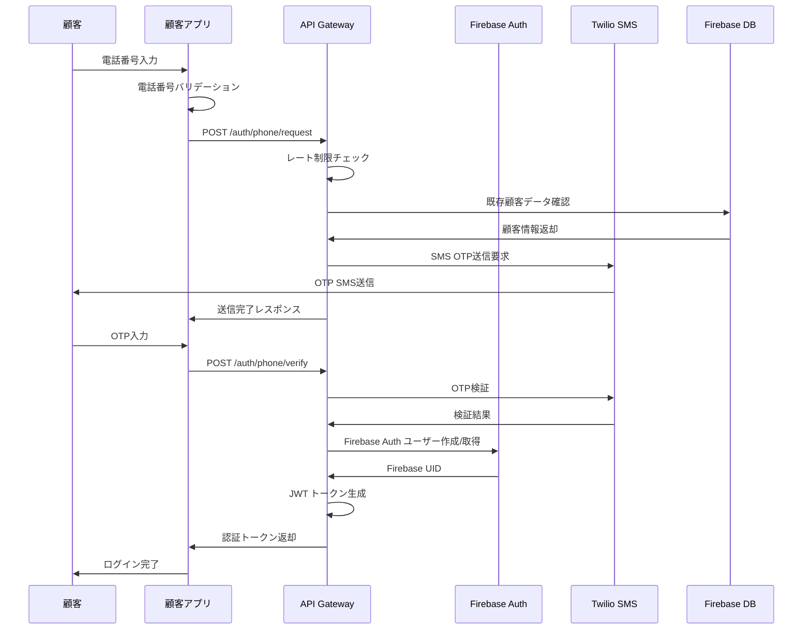
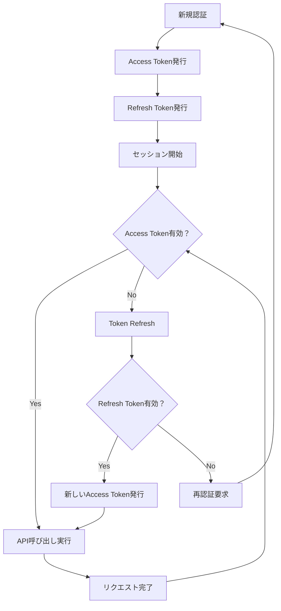

# 顧客認証システム設計書

## 1. 認証システム概要

### 1.1 設計方針
美容室顧客向けの安全で使いやすい認証システムを提供し、既存の美容室管理システムとシームレスに統合する。

### 1.2 認証要件
- **利便性**: 美容室顧客（主に20-60代女性）にとって使いやすい認証方法
- **セキュリティ**: 個人情報保護とプライバシーの確保
- **統合性**: 既存の顧客データベースとの整合性
- **拡張性**: 将来の機能追加に対応

## 2. 認証方式設計

### 2.1 認証方式の比較検討

| 認証方式 | 利便性 | セキュリティ | 実装難易度 | 推奨度 |
|----------|--------|--------------|------------|---------|
| 電話番号 + SMS OTP | ⭐⭐⭐⭐⭐ | ⭐⭐⭐⭐ | ⭐⭐⭐ | **最優先** |
| メールアドレス + パスワード | ⭐⭐⭐ | ⭐⭐⭐ | ⭐⭐⭐⭐⭐ | 推奨 |
| LINE Login | ⭐⭐⭐⭐⭐ | ⭐⭐⭐⭐ | ⭐⭐⭐ | 推奨 |
| Google OAuth | ⭐⭐⭐⭐ | ⭐⭐⭐⭐⭐ | ⭐⭐⭐⭐ | オプション |
| Facebook Login | ⭐⭐⭐ | ⭐⭐⭐ | ⭐⭐⭐⭐ | オプション |

### 2.2 主要認証方式：電話番号 + SMS OTP

#### 2.2.1 フロー設計



#### 2.2.2 セキュリティ対策

```javascript
const PhoneAuthSecurity = {
  // OTP設定
  otp: {
    length: 6,
    expiry: 5 * 60 * 1000, // 5分
    max_attempts: 3,
    character_set: 'numeric'
  },
  
  // レート制限
  rate_limits: {
    phone_request: {
      window: 15 * 60 * 1000, // 15分
      max_requests: 3,
      block_duration: 60 * 60 * 1000 // 1時間
    },
    otp_verify: {
      window: 5 * 60 * 1000, // 5分
      max_attempts: 5
    }
  },
  
  // 電話番号検証
  phone_validation: {
    format: /^\+81[0-9]{10,11}$/, // 日本の電話番号
    blacklist: [], // ブロックリスト
    whitelist: null // ホワイトリスト（未使用）
  },
  
  // 不正利用防止
  fraud_prevention: {
    device_fingerprinting: true,
    ip_geolocation: true,
    suspicious_pattern_detection: true
  }
};
```

### 2.3 サブ認証方式：メールアドレス認証

#### 2.3.1 実装仕様

```javascript
const EmailAuthConfig = {
  // パスワード要件
  password_requirements: {
    min_length: 8,
    require_uppercase: true,
    require_lowercase: true,
    require_numbers: true,
    require_symbols: false,
    common_passwords_check: true
  },
  
  // メール認証
  email_verification: {
    required: true,
    expiry: 24 * 60 * 60 * 1000, // 24時間
    template: 'salon_verification'
  },
  
  // パスワードリセット
  password_reset: {
    expiry: 1 * 60 * 60 * 1000, // 1時間
    max_attempts: 3,
    template: 'salon_password_reset'
  }
};
```

### 2.4 SNS連携認証

#### 2.4.1 LINE Login 統合

```javascript
const LineLoginConfig = {
  client_id: process.env.LINE_CLIENT_ID,
  client_secret: process.env.LINE_CLIENT_SECRET,
  redirect_uri: 'https://salon-app.com/auth/line/callback',
  
  // 要求するスコープ
  scope: ['profile', 'openid'],
  
  // 取得する情報
  profile_fields: [
    'userId',
    'displayName', 
    'pictureUrl'
  ],
  
  // セキュリティ設定
  security: {
    state_parameter: true,
    nonce_parameter: true,
    pkce: true
  }
};
```

#### 2.4.2 Google OAuth 統合

```javascript
const GoogleOAuthConfig = {
  client_id: process.env.GOOGLE_CLIENT_ID,
  client_secret: process.env.GOOGLE_CLIENT_SECRET,
  redirect_uri: 'https://salon-app.com/auth/google/callback',
  
  // 要求するスコープ
  scope: [
    'openid',
    'profile',
    'email'
  ],
  
  // セキュリティ設定
  security: {
    state_parameter: true,
    nonce_parameter: true,
    pkce: true
  }
};
```

## 3. トークン管理設計

### 3.1 JWT トークン仕様

```javascript
const JWTConfig = {
  // Access Token
  access_token: {
    algorithm: 'HS256',
    expiry: '1h',
    issuer: 'salon-app.com',
    audience: 'customer-app',
    
    payload: {
      sub: 'customer_id',
      iat: 'issued_at',
      exp: 'expires_at',
      jti: 'jwt_id',
      
      // カスタムクレーム
      customer_id: 'uuid',
      salon_id: 'uuid',
      phone: 'phone_number',
      email: 'email_address',
      verified: 'boolean',
      role: 'customer',
      permissions: ['read:profile', 'update:profile', 'create:appointment']
    }
  },
  
  // Refresh Token
  refresh_token: {
    algorithm: 'HS256',
    expiry: '30d',
    one_time_use: false,
    
    payload: {
      sub: 'customer_id',
      iat: 'issued_at',
      exp: 'expires_at',
      jti: 'jwt_id',
      token_type: 'refresh'
    }
  }
};
```

### 3.2 トークンライフサイクル管理



### 3.3 トークン無効化戦略

```javascript
const TokenRevocationStrategy = {
  // ブラックリスト管理
  blacklist: {
    storage: 'redis',
    key_prefix: 'revoked_tokens:',
    ttl: 86400 // 24時間
  },
  
  // 無効化トリガー
  revocation_triggers: [
    'explicit_logout',
    'password_change',
    'suspicious_activity',
    'admin_action',
    'token_compromise'
  ],
  
  // グローバル無効化
  global_revocation: {
    user_level: true, // 特定ユーザーの全トークン
    device_level: true, // 特定デバイスの全トークン
    session_level: false // 特定セッションのみ
  }
};
```

## 4. 既存システム統合

### 4.1 顧客データ統合戦略

```javascript
const CustomerIntegration = {
  // データマッピング
  mapping: {
    phone_number: 'customers.phoneNumber',
    email: 'customers.email',
    first_name: 'customers.firstName',
    last_name: 'customers.lastName',
    customer_id: 'customers.id'
  },
  
  // 照合ロジック
  matching_strategy: {
    primary: 'phone_number', // 主要キー
    secondary: 'email',      // 副次キー
    fallback: 'name + birth_date' // フォールバック
  },
  
  // 統合フロー
  integration_flow: {
    1: 'phone_number_lookup',
    2: 'email_lookup',
    3: 'create_new_customer',
    4: 'link_accounts'
  }
};
```

### 4.2 権限マッピング

```javascript
const PermissionMapping = {
  customer: {
    // プロフィール権限
    'read:own_profile': true,
    'update:own_profile': true,
    'delete:own_profile': false,
    
    // 予約権限
    'read:own_appointments': true,
    'create:appointments': true,
    'update:own_appointments': true,
    'cancel:own_appointments': true,
    
    // 履歴権限
    'read:own_history': true,
    'read:own_photos': true,
    
    // 通信権限
    'send:messages': true,
    'read:own_messages': true,
    
    // 制限
    'read:other_customers': false,
    'admin:functions': false
  }
};
```

## 5. 多要素認証（MFA）設計

### 5.1 MFA オプション

```javascript
const MFAOptions = {
  // TOTP（Time-based OTP）
  totp: {
    enabled: true,
    issuer: 'Salon App',
    algorithm: 'SHA1',
    digits: 6,
    period: 30
  },
  
  // SMS バックアップコード
  sms_backup: {
    enabled: true,
    code_length: 8,
    expiry: 10 * 60 * 1000 // 10分
  },
  
  // バックアップコード
  backup_codes: {
    enabled: true,
    count: 10,
    length: 8,
    one_time_use: true
  }
};
```

### 5.2 段階的MFA導入

| フェーズ | 対象 | MFA要件 | 実装時期 |
|----------|------|---------|----------|
| Phase 1 | 全顧客 | SMS OTP（既存） | ✅ 完了 |
| Phase 2 | 高額利用顧客 | TOTP推奨 | 3ヶ月後 |
| Phase 3 | 全顧客 | 選択式MFA | 6ヶ月後 |
| Phase 4 | 機密情報アクセス | 必須MFA | 9ヶ月後 |

## 6. セキュリティ監視・監査

### 6.1 認証ログ設計

```javascript
const AuthenticationLog = {
  event_types: [
    'login_attempt',
    'login_success',
    'login_failure',
    'logout',
    'token_refresh',
    'password_change',
    'mfa_setup',
    'account_lock'
  ],
  
  log_structure: {
    timestamp: 'ISO 8601',
    event_type: 'string',
    user_id: 'uuid',
    session_id: 'uuid',
    ip_address: 'ipv4/ipv6',
    user_agent: 'string',
    result: 'success/failure',
    error_code: 'optional_string',
    additional_context: 'json'
  },
  
  retention: {
    success_logs: 90, // 90日
    failure_logs: 365, // 1年
    security_incidents: 2555 // 7年（個人情報保護法準拠）
  }
};
```

### 6.2 異常検知システム

```javascript
const AnomalyDetection = {
  detection_rules: [
    {
      name: 'multiple_failed_logins',
      condition: 'failed_attempts > 5 in 15 minutes',
      action: 'temporary_account_lock'
    },
    {
      name: 'unusual_location',
      condition: 'login from different country',
      action: 'require_additional_verification'
    },
    {
      name: 'concurrent_sessions',
      condition: 'sessions > 3 from different devices',
      action: 'alert_user'
    },
    {
      name: 'brute_force_attack',
      condition: 'failed_attempts > 100 from same IP',
      action: 'ip_block'
    }
  ],
  
  response_actions: {
    temporary_account_lock: {
      duration: 30 * 60 * 1000, // 30分
      notification: true
    },
    require_additional_verification: {
      method: 'sms_otp',
      bypass: false
    },
    alert_user: {
      channels: ['email', 'push'],
      template: 'security_alert'
    },
    ip_block: {
      duration: 24 * 60 * 60 * 1000, // 24時間
      whitelist_override: true
    }
  }
};
```

## 7. プライバシー・コンプライアンス

### 7.1 個人情報保護対応

```javascript
const PrivacyCompliance = {
  // データ分類
  data_classification: {
    public: ['service_info', 'salon_hours'],
    internal: ['appointment_history', 'preferences'],
    confidential: ['phone_number', 'email', 'payment_info'],
    restricted: ['medical_info', 'sensitive_notes']
  },
  
  // 保存期間
  retention_policy: {
    account_active: 'unlimited',
    account_inactive: 365, // 1年後削除
    marketing_consent: 2555, // 7年（マーケティング履歴）
    legal_requirement: 2555 // 7年（法的要件）
  },
  
  // 同意管理
  consent_management: {
    required_consents: [
      'service_usage',
      'personal_data_processing'
    ],
    optional_consents: [
      'marketing_communications',
      'data_analytics',
      'third_party_integrations'
    ]
  }
};
```

### 7.2 GDPR準拠機能

```javascript
const GDPRCompliance = {
  // 個人データの権利
  data_rights: {
    access: {
      endpoint: '/api/v1/privacy/data-export',
      format: ['json', 'pdf'],
      delivery: 'email'
    },
    
    rectification: {
      endpoint: '/api/v1/customer/profile',
      method: 'PUT',
      verification: 'required'
    },
    
    erasure: {
      endpoint: '/api/v1/privacy/delete-account',
      confirmation: 'email_verification',
      grace_period: 7 * 24 * 60 * 60 * 1000 // 7日
    },
    
    portability: {
      endpoint: '/api/v1/privacy/data-export',
      format: 'json',
      includes: ['profile', 'appointments', 'messages']
    }
  }
};
```

## 8. 実装ガイドライン

### 8.1 開発環境セットアップ

```bash
# 認証サービス依存関係
npm install --save \
  firebase-admin \
  firebase \
  jsonwebtoken \
  bcryptjs \
  speakeasy \
  qrcode \
  twilio \
  @sendgrid/mail

# 開発依存関係
npm install --save-dev \
  @types/jsonwebtoken \
  jest \
  supertest
```

### 8.2 設定ファイルテンプレート

```javascript
// config/auth.js
module.exports = {
  jwt: {
    secret: process.env.JWT_SECRET,
    algorithm: 'HS256',
    accessTokenExpiry: '1h',
    refreshTokenExpiry: '30d'
  },
  
  firebase: {
    projectId: process.env.FIREBASE_PROJECT_ID,
    clientEmail: process.env.FIREBASE_CLIENT_EMAIL,
    privateKey: process.env.FIREBASE_PRIVATE_KEY.replace(/\\n/g, '\n')
  },
  
  twilio: {
    accountSid: process.env.TWILIO_ACCOUNT_SID,
    authToken: process.env.TWILIO_AUTH_TOKEN,
    phoneNumber: process.env.TWILIO_PHONE_NUMBER
  },
  
  line: {
    clientId: process.env.LINE_CLIENT_ID,
    clientSecret: process.env.LINE_CLIENT_SECRET,
    redirectUri: process.env.LINE_REDIRECT_URI
  }
};
```

## 9. テスト戦略

### 9.1 テストカテゴリ

```javascript
const TestStrategy = {
  unit_tests: [
    'token_generation',
    'password_hashing',
    'otp_generation',
    'phone_number_validation'
  ],
  
  integration_tests: [
    'sms_otp_flow',
    'email_verification',
    'social_login_flow',
    'token_refresh'
  ],
  
  security_tests: [
    'jwt_tampering',
    'brute_force_protection',
    'rate_limiting',
    'session_hijacking'
  ],
  
  e2e_tests: [
    'complete_registration_flow',
    'login_and_access_protected_resource',
    'password_reset_flow',
    'account_deletion_flow'
  ]
};
```

この認証システム設計により、美容室顧客にとって安全で使いやすい認証体験を提供し、既存システムとの統合を実現します。