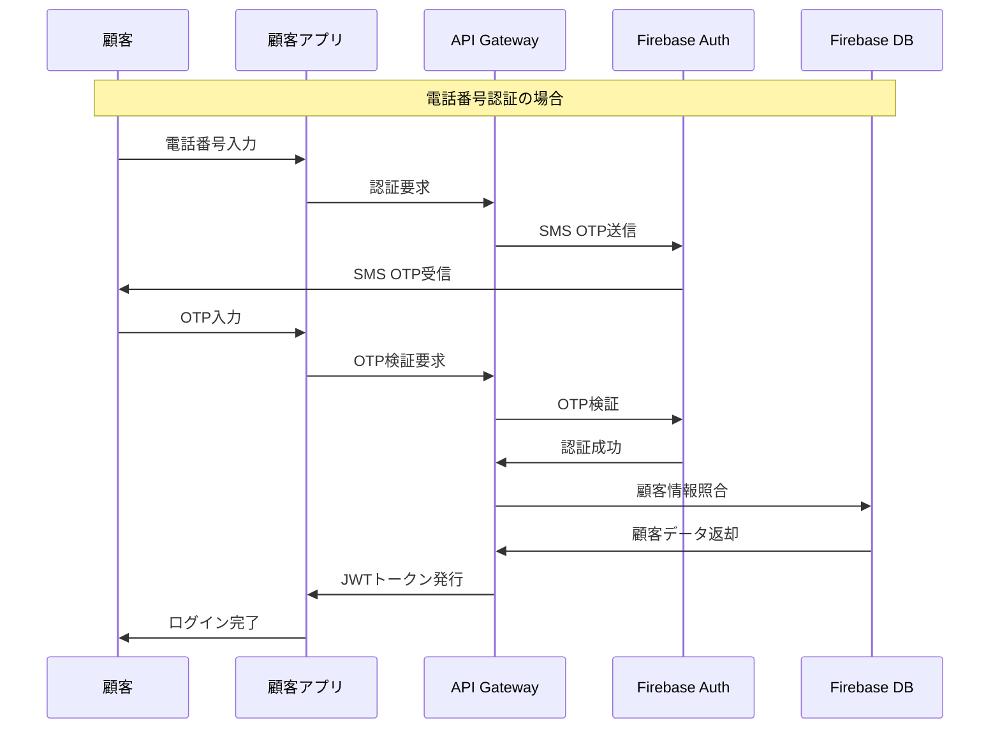

# 顧客向け美容室アプリ - 全体アーキテクチャ設計

## 1. システム概要

### 1.1 現在のシステム構成
- **管理システム**: http://localhost:3001
- **技術スタック**: Node.js + Express + Firebase + Vercel
- **データベース**: Firebase/Sequelize（ハイブリッド構成）
- **認証**: JWT + bcrypt

### 1.2 顧客アプリの位置づけ
```
[美容室管理者] ←→ [管理システム] ←→ [API Gateway] ←→ [顧客アプリ]
                                          ↕
                                     [Firebase DB]
```

## 2. アーキテクチャ設計方針

### 2.1 設計原則
1. **セキュリティファースト**: 管理者データと顧客データの完全分離
2. **スケーラビリティ**: マルチテナント対応（複数美容室対応）
3. **ユーザビリティ**: 美容室顧客に特化したUX
4. **パフォーマンス**: PWA対応でネイティブアプリ相当の体験
5. **運用性**: 既存システムとのシームレス統合

### 2.2 品質属性要件
- **可用性**: 99.9%（美容室営業時間中）
- **応答性**: 2秒以内のページロード
- **セキュリティ**: OWASP準拠
- **拡張性**: 1000美容室×10000顧客対応
- **保守性**: モジュラー設計

## 3. システムアーキテクチャ

### 3.1 全体アーキテクチャ（C4 - Context Level）

```
┌─────────────────────────────────────────────────────────────┐
│                    顧客向け美容室アプリ                      │
├─────────────────────────────────────────────────────────────┤
│                                                             │
│  [顧客]    [美容室スタッフ]    [美容室経営者]    [システム管理者] │
│    │              │                │               │        │
│    └──────────────┼────────────────┼───────────────┘        │
│                   │                │                        │
│              ┌────┴─────┐     ┌────┴─────┐                 │
│              │顧客アプリ  │     │管理システム│                 │
│              │(PWA)     │     │(既存)     │                 │
│              └──────────┘     └──────────┘                 │
│                   │                │                        │
│                   └────────────────┼────────────────────    │
│                                    │                        │
│                             ┌─────┴─────┐                  │
│                             │API Gateway│                  │
│                             │& Services │                  │
│                             └───────────┘                  │
│                                    │                        │
│                             ┌─────┴─────┐                  │
│                             │Firebase DB│                  │
│                             └───────────┘                  │
└─────────────────────────────────────────────────────────────┘
```

### 3.2 コンテナ図（C4 - Container Level）

```
┌─────────────────────────────────────────────────────────────┐
│                    SMS美容室管理システム                      │
├─────────────────────────────────────────────────────────────┤
│                                                             │
│  ┌─────────────┐    ┌──────────────┐    ┌─────────────────┐ │
│  │顧客PWAアプリ  │    │管理Webアプリ   │    │予約ウィジェット   │ │
│  │React/Vue    │    │(既存)        │    │(既存)          │ │
│  │Service Worker│   │Express Views │    │JavaScript      │ │
│  └─────────────┘    └──────────────┘    └─────────────────┘ │
│         │                   │                      │        │
│         └───────────────────┼──────────────────────┘        │
│                             │                               │
│                    ┌────────┴────────┐                     │
│                    │API Gateway      │                     │
│                    │Express.js       │                     │
│                    │Rate Limiting    │                     │
│                    │Authentication   │                     │
│                    │Authorization    │                     │
│                    └─────────────────┘                     │
│                             │                               │
│     ┌───────────────────────┼───────────────────────────┐   │
│     │                       │                           │   │
│ ┌───▼────┐  ┌──────▼──────┐  ┌───▼────┐  ┌──────▼──────┐ │
│ │Customer│  │Appointment  │  │Message │  │Analytics    │ │
│ │Service │  │Service      │  │Service │  │Service      │ │
│ └────────┘  └─────────────┘  └────────┘  └─────────────┘ │
│     │              │              │             │        │
│     └──────────────┼──────────────┼─────────────┘        │
│                    │              │                      │
│              ┌─────┴──────────────┴─────┐                │
│              │Firebase Database        │                │
│              │- Firestore (NoSQL)      │                │
│              │- Authentication         │                │
│              │- Storage (Images)       │                │
│              └─────────────────────────┘                │
│                                                          │
│  ┌────────────────────────────────────────────────────┐  │
│  │External Services                                   │  │
│  │- Twilio (SMS)                                      │  │
│  │- SendGrid (Email)                                  │  │
│  │- LINE Messaging API                                │  │
│  │- Instagram Basic Display API                       │  │
│  │- Google Calendar API                               │  │
│  └────────────────────────────────────────────────────┘  │
└─────────────────────────────────────────────────────────────┘
```

## 4. 顧客認証システム設計

### 4.1 認証方式
1. **電話番号認証（主要）**
   - SMS OTP による本人確認
   - 国際化対応（+81形式）
   - 既存顧客データとの自動照合

2. **メールアドレス認証**
   - メール認証リンク
   - パスワードリセット機能
   - 既存顧客データとの照合

3. **SNS連携認証**
   - LINE Login
   - Google OAuth 2.0
   - Facebook Login（オプション）

### 4.2 認証フロー



### 4.3 セキュリティ対策
- **JWT トークン**: 短期間（1時間）+ リフレッシュトークン（30日）
- **Rate Limiting**: 1分間に5回までの認証試行
- **Device Fingerprinting**: 不正アクセス検知
- **IP Whitelist**: 美容室IPアドレスからの管理操作制限

## 5. データアーキテクチャ

### 5.1 データ分離戦略
```
Firebase Project: "sms-salon-system"
├── Collections
│   ├── salons/ (美容室マスター)
│   ├── users/ (管理者データ) 🔒 Admin Only
│   ├── customers/ (顧客データ) 🔐 Customer Read/Update
│   ├── appointments/ (予約データ) 🔐 Shared Access
│   ├── services/ (サービス情報) 📖 Public Read
│   └── customer_profiles/ (顧客専用データ) 🔐 Customer Only
└── Security Rules
    ├── admin.rules (管理者権限)
    ├── customer.rules (顧客権限)
    └── public.rules (公開情報)
```

### 5.2 顧客データモデル拡張

```javascript
// 既存のCustomerモデルに追加
const CustomerProfile = {
  // 既存フィールド継承
  ...Customer,
  
  // 顧客アプリ専用フィールド
  app_preferences: {
    notifications: {
      push: true,
      sms: true,
      email: true,
      line: false
    },
    language: 'ja',
    theme: 'light'
  },
  
  loyalty_points: 0,
  member_tier: 'regular', // regular, silver, gold, platinum
  
  // プライベート情報（顧客のみアクセス可能）
  personal_notes: '',
  beauty_goals: [],
  skin_type: '',
  hair_type: '',
  allergies: [],
  
  // アプリ使用状況
  last_app_login: null,
  app_version: '',
  device_info: '',
  
  // セキュリティ
  two_factor_enabled: false,
  trusted_devices: []
};
```

## 6. API設計

### 6.1 APIアーキテクチャ
- **RESTful API**: 基本的なCRUD操作
- **GraphQL**: 複雑なデータ取得（将来拡張）
- **WebSocket**: リアルタイム通知
- **Webhook**: 外部システム連携

### 6.2 主要APIエンドポイント

```
POST /api/v1/auth/phone          # 電話番号認証開始
POST /api/v1/auth/verify         # OTP検証
POST /api/v1/auth/refresh        # トークンリフレッシュ
POST /api/v1/auth/logout         # ログアウト

GET  /api/v1/customer/profile    # プロフィール取得
PUT  /api/v1/customer/profile    # プロフィール更新
GET  /api/v1/customer/history    # 来店履歴
GET  /api/v1/customer/points     # ポイント残高

GET  /api/v1/appointments        # 予約一覧
POST /api/v1/appointments        # 新規予約
PUT  /api/v1/appointments/:id    # 予約変更
DEL  /api/v1/appointments/:id    # 予約キャンセル

GET  /api/v1/services           # サービス一覧
GET  /api/v1/availability       # 空き時間
GET  /api/v1/staff              # スタッフ情報

POST /api/v1/messages           # メッセージ送信
GET  /api/v1/conversations      # 会話履歴

GET  /api/v1/campaigns          # キャンペーン情報
GET  /api/v1/notifications      # 通知履歴
```

### 6.3 セキュリティ設計

```javascript
// API Gateway セキュリティミドルウェア
const securityMiddleware = [
  helmet(),                    // セキュリティヘッダー
  rateLimit({                 // レート制限
    windowMs: 15 * 60 * 1000,
    max: 100
  }),
  cors({                      // CORS設定
    origin: ['https://salon-customer-app.vercel.app'],
    credentials: true
  }),
  authenticateCustomer,       // JWT認証
  authorizeCustomer,          // 権限チェック
  auditLog                    // アクセスログ
];
```

## 7. フロントエンド設計

### 7.1 技術スタック選定

| 要件 | 選択肢 | 推奨 | 理由 |
|------|--------|------|------|
| フレームワーク | React, Vue.js, Svelte | **React** | エコシステム、PWA対応、開発効率 |
| ビルドツール | Vite, Webpack, Parcel | **Vite** | 高速、モダン、設定簡単 |
| UI コンポーネント | Material-UI, Chakra UI, Ant Design | **Chakra UI** | 軽量、カスタマイズ性、美容業界向けデザイン |
| 状態管理 | Redux, Zustand, Jotai | **Zustand** | シンプル、TypeScript対応 |
| PWA | Workbox, PWA Builder | **Workbox** | Google製、豊富な機能 |
| 通知 | Firebase FCM, OneSignal | **Firebase FCM** | 既存Firebase統合 |

### 7.2 PWA設計

```javascript
// Service Worker設定
const swConfig = {
  runtimeCaching: [
    {
      urlPattern: /^https:\/\/api\.salon-app\.com\//,
      handler: 'NetworkFirst',
      options: {
        cacheName: 'api-cache',
        expiration: {
          maxEntries: 50,
          maxAgeSeconds: 5 * 60, // 5分
        },
      },
    },
    {
      urlPattern: /\.(?:png|gif|jpg|jpeg|svg)$/,
      handler: 'CacheFirst',
      options: {
        cacheName: 'image-cache',
        expiration: {
          maxEntries: 100,
          maxAgeSeconds: 30 * 24 * 60 * 60, // 30日
        },
      },
    },
  ],
  offline: {
    precache: [
      '/',
      '/appointments',
      '/profile',
      '/history',
    ],
    fallback: '/offline.html',
  },
};
```

## 8. 美容室特化機能

### 8.1 来店前アンケート機能

```javascript
const PreVisitSurvey = {
  salon_id: 'salon_123',
  customer_id: 'customer_456',
  appointment_id: 'apt_789',
  
  questions: [
    {
      type: 'single_choice',
      question: '今日の体調はいかがですか？',
      options: ['とても良い', '良い', '普通', '少し悪い', '悪い'],
      required: true
    },
    {
      type: 'multiple_choice',
      question: '今回希望する施術を教えてください',
      options: ['カット', 'カラー', 'パーマ', 'トリートメント', 'ヘッドスパ'],
      required: true
    },
    {
      type: 'text',
      question: '髪の悩みや要望があれば教えてください',
      max_length: 500,
      required: false
    }
  ],
  
  responses: {},
  submitted_at: null,
  expires_at: new Date(Date.now() + 24*60*60*1000) // 24時間後
};
```

### 8.2 施術記録・写真機能

```javascript
const TreatmentRecord = {
  appointment_id: 'apt_789',
  customer_id: 'customer_456',
  salon_id: 'salon_123',
  
  before_photos: [
    {
      url: 'https://storage.salon.com/before_123.jpg',
      angle: 'front',
      timestamp: new Date()
    }
  ],
  
  after_photos: [
    {
      url: 'https://storage.salon.com/after_123.jpg',
      angle: 'front',
      timestamp: new Date()
    }
  ],
  
  treatments: [
    {
      service: 'カット',
      details: 'レイヤーカット、前髪調整',
      products_used: ['シャンプーA', 'トリートメントB'],
      duration: 60
    }
  ],
  
  styling_notes: 'スタイリングのポイント...',
  next_visit_recommendation: '6-8週間後',
  
  customer_visible: true, // 顧客に表示するか
  private_notes: 'スタッフ用メモ...' // 顧客には表示されない
};
```

### 8.3 ポイント・特典システム

```javascript
const LoyaltySystem = {
  point_rules: {
    visit: 100,           // 来店ごと
    spend: 0.01,         // 1円 = 0.01ポイント
    referral: 500,       // 紹介ごと
    review: 50,          // レビュー投稿
    birthday: 1000       // 誕生月
  },
  
  tier_benefits: {
    regular: {
      point_multiplier: 1.0,
      discount: 0,
      perks: ['誕生月ポイント2倍']
    },
    silver: {
      point_multiplier: 1.2,
      discount: 0.05,
      perks: ['優先予約', '誕生月ポイント2倍']
    },
    gold: {
      point_multiplier: 1.5,
      discount: 0.10,
      perks: ['優先予約', '無料ドリンク', '誕生月ポイント3倍']
    }
  },
  
  redemption_options: [
    { points: 1000, reward: '500円割引', type: 'discount' },
    { points: 2000, reward: 'ヘッドスパ無料', type: 'service' },
    { points: 5000, reward: 'トリートメント無料', type: 'service' }
  ]
};
```

## 9. セキュリティ設計

### 9.1 脅威モデル

| 脅威 | 影響度 | 確率 | 対策 |
|------|--------|------|------|
| 顧客情報漏洩 | 高 | 中 | 暗号化、アクセス制御、監査ログ |
| 不正ログイン | 高 | 中 | MFA、デバイス認証、異常検知 |
| APIの不正利用 | 中 | 高 | レート制限、API키 管리、WAF |
| SQLインジェクション | 中 | 低 | パラメータ化クエリ、入力検証 |
| XSS攻撃 | 中 | 中 | CSP、入力サニタイゼーション |

### 9.2 セキュリティ境界

```
インターネット
     ↓
  [WAF/CDN]
     ↓
  [Load Balancer]
     ↓
  [API Gateway] ← 認証・認可・レート制限
     ↓
┌─────────────────┐    ┌─────────────────┐
│  顧客サービス    │    │  管理サービス    │
│  (Customer)     │    │  (Admin)        │
└─────────────────┘    └─────────────────┘
     ↓                        ↓
┌─────────────────┐    ┌─────────────────┐
│ 顧客データベース  │    │ 管理データベース  │
│ (Read/Write)    │    │ (Admin Only)    │
└─────────────────┘    └─────────────────┘
```

### 9.3 データ暗号化戦略

```javascript
// 暗号化レベル定義
const DataClassification = {
  PUBLIC: {
    // サービス情報、営業時間等
    encryption: 'none',
    access: 'all'
  },
  
  INTERNAL: {
    // 予約情報、履歴等
    encryption: 'aes-256',
    access: 'authenticated'
  },
  
  CONFIDENTIAL: {
    // 個人情報、決済情報等
    encryption: 'aes-256',
    hashing: 'argon2',
    access: 'owner_only'
  },
  
  RESTRICTED: {
    // 医療情報、機密事項等
    encryption: 'aes-256',
    tokenization: true,
    access: 'staff_only'
  }
};
```

## 10. パフォーマンス設計

### 10.1 パフォーマンス目標

| メトリクス | 目標値 | 測定方法 |
|------------|--------|----------|
| First Contentful Paint | < 1.5秒 | Lighthouse |
| Largest Contentful Paint | < 2.5秒 | Core Web Vitals |
| Time to Interactive | < 3.0秒 | Lighthouse |
| Cumulative Layout Shift | < 0.1 | Core Web Vitals |
| API Response Time | < 200ms | APM監視 |

### 10.2 最適化戦略

```javascript
// パフォーマンス最適化設定
const PerformanceConfig = {
  // コード分割
  code_splitting: {
    routes: true,        // ルートベース分割
    components: true,    // コンポーネント遅延読み込み
    vendor: true         // サードパーティ分離
  },
  
  // キャッシング
  caching: {
    static_assets: '365d',   // 静的ファイル
    api_responses: '5m',     // API レスポンス
    images: '30d'           // 画像ファイル
  },
  
  // 画像最適化
  image_optimization: {
    formats: ['webp', 'avif', 'jpg'],
    sizes: [320, 640, 1024, 1920],
    quality: 85,
    lazy_loading: true
  },
  
  // バンドル最適化
  bundle_optimization: {
    tree_shaking: true,
    minification: true,
    compression: 'gzip',
    source_maps: false // production
  }
};
```

この設計書は、顧客向け美容室アプリの包括的なアーキテクチャを定義しています。次のセクションでは、各技術選定の詳細な根拠と実装計画について説明します。