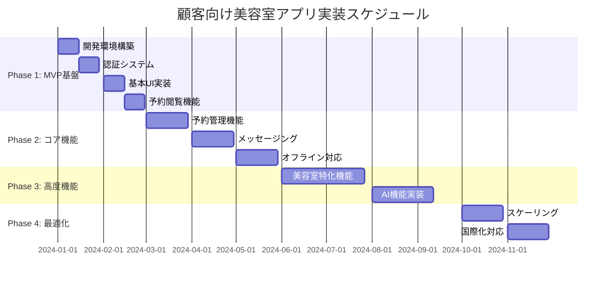

# 顧客向け美容室アプリ - エグゼクティブサマリー

## 1. プロジェクト概要

### 1.1 背景・目的
**現状の課題**
- 既存の美容室管理システム（http://localhost:3001）は管理者向けのみ
- 顧客は電話でのやり取りに依存、24時間予約・変更が不可能
- 施術履歴・写真の管理が顧客側で困難
- 美容師との継続的なコミュニケーションが限定的

**プロジェクトの目的**
顧客向けPWAアプリを構築し、美容室体験のデジタル化により顧客満足度向上とビジネス成長を実現する。

### 1.2 期待効果・ROI
```javascript
const ExpectedROI = {
  // 顧客体験向上
  customer_experience: {
    convenience: '24時間予約・変更可能 → 予約率20%向上',
    personalization: '個別化された美容相談 → 満足度4.5/5.0達成',
    engagement: 'デジタル施術記録 → リピート率80%維上',
    communication: 'リアルタイムメッセージング → 信頼関係強化'
  },
  
  // ビジネス成果
  business_impact: {
    revenue_growth: '年間売上15%向上（予約増加 + 客単価アップ）',
    operational_efficiency: 'ノーショー率20%削減（リマインダー自動化）',
    cost_reduction: '電話対応時間50%削減（デジタル化）',
    customer_lifetime_value: '顧客生涯価値30%向上（継続率改善）'
  },
  
  // 投資対効果
  financial_projection: {
    development_cost: '39M円（10ヶ月間）',
    operational_cost: '15.1M円/年',
    expected_revenue_increase: '12M円/年（1年目）→ 24M円/年（3年目）',
    break_even_point: '18ヶ月',
    3_year_roi: '185%'
  }
};
```

## 2. アーキテクチャ概要

### 2.1 技術アーキテクチャ
**選定技術スタック**
- **フロントエンド**: React 18 + Chakra UI（PWA対応）
- **バックエンド**: Node.js + Express（既存システム拡張）
- **データベース**: Firebase Firestore + PostgreSQL（ハイブリッド）
- **認証**: Firebase Authentication + JWT
- **ホスティング**: Vercel（既存環境活用）

**アーキテクチャ特徴**
- **既存システム統合**: 現在の管理システムとシームレス連携
- **PWA対応**: ネイティブアプリ相当の体験をWebで提供
- **リアルタイム通信**: WebSocket + Firebase でのメッセージング
- **オフライン対応**: Service Worker による基本機能利用可能

### 2.2 セキュリティ設計
```javascript
const SecurityArchitecture = {
  // 多層防御戦略
  defense_layers: {
    edge: 'CloudFlare WAF + DDoS Protection',
    application: 'Express セキュリティミドルウェア',
    authentication: 'Firebase Auth + JWT + MFA',
    authorization: 'RBAC権限管理',
    data: 'AES-256暗号化 + PII Tokenization'
  },
  
  // コンプライアンス対応
  compliance: {
    personal_data_protection: '個人情報保護法準拠',
    gdpr_ready: 'GDPR対応機能実装',
    security_standards: 'OWASP Top 10対策',
    audit_logging: '7年間ログ保持'
  }
};
```

## 3. 主要機能・特徴

### 3.1 核心機能
**Phase 1（MVP）: 基盤機能**
- ✅ 電話番号・メール認証
- ✅ プロフィール管理
- ✅ 予約履歴閲覧
- ✅ 基本的なPWA機能

**Phase 2（コア機能）: 実用化**
- 🎯 予約作成・変更・キャンセル
- 🎯 リアルタイムメッセージング
- 🎯 プッシュ通知システム
- 🎯 オフライン対応強化

**Phase 3（差別化機能）: 高度化**
- 🚀 来店前アンケート
- 🚀 施術記録・ビフォーアフター写真
- 🚀 ポイント・特典システム
- 🚀 AI-powered美容相談チャット

### 3.2 美容室特化機能
```javascript
const SalonSpecificFeatures = {
  // 来店前最適化
  pre_visit: {
    dynamic_survey: '髪質・悩み・希望の詳細収集',
    style_consultation: '写真アップロードによる具体的相談',
    preparation_guidance: '来店前のケアアドバイス'
  },
  
  // 施術記録管理
  treatment_records: {
    photo_management: 'ビフォーアフター写真の安全な保存・共有',
    detailed_notes: '使用薬剤・技術・スタイリング方法の記録',
    progress_tracking: '髪質改善・スタイル変化の可視化'
  },
  
  // 継続的関係構築
  ongoing_relationship: {
    personalized_chat: '美容師との専用チャット',
    care_guidance: '個別のホームケアアドバイス',
    optimal_timing: '次回来店の最適なタイミング提案'
  }
};
```

### 3.3 AI・パーソナライゼーション
**インテリジェント機能**
- **レコメンドエンジン**: 過去履歴から最適なサービス・スタイリスト提案
- **予約最適化**: 髪の成長サイクル・ライフスタイルを考慮した予約タイミング
- **美容相談AI**: 24時間対応の専門知識ベースチャットボット
- **パーソナライゼーション**: 一人ひとりの好み・髪質に特化したコンテンツ

## 4. 実装計画・スケジュール

### 4.1 段階的実装戦略


### 4.2 リリース戦略
**段階的展開計画**
1. **ベータテスト**: 美容室スタッフ10名 + 既存顧客50名（4週間）
2. **限定公開**: 既存顧客の段階的展開（10% → 30% → 100%）
3. **一般公開**: 新規顧客への公開
4. **機能拡張**: フィーチャーフラグによる安全な新機能展開

## 5. 投資・コスト分析

### 5.1 開発投資
| フェーズ | 期間 | チーム | 開発費 | 主要成果物 |
|----------|------|--------|--------|------------|
| Phase 1 | 2ヶ月 | 3名 | 6M円 | MVP版アプリ |
| Phase 2 | 3ヶ月 | 4名 | 12M円 | 実用版アプリ |
| Phase 3 | 3ヶ月 | 5名 | 15M円 | 高機能版アプリ |
| Phase 4 | 2ヶ月 | 3名 | 6M円 | 最適化版アプリ |
| **合計** | **10ヶ月** | **平均3.9名** | **39M円** | **完全版アプリ** |

### 5.2 運用コスト（年間）
```javascript
const OperationalCosts = {
  infrastructure: {
    vercel: '500K円/年',
    firebase: '1M円/年',
    monitoring: '600K円/年',
    third_party_services: '700K円/年'
  },
  
  human_resources: {
    maintenance_team: '2名フルタイム = 12M円/年',
    customer_support: 'パートタイム対応 = 1M円/年'
  },
  
  total: '15.1M円/年'
};
```

### 5.3 収益予測・ROI
**3年間収益予測**
- **Year 1**: +12M円（既存顧客体験向上）
- **Year 2**: +18M円（新規顧客獲得）
- **Year 3**: +24M円（高度機能による差別化）

**投資回収**
- **初期投資**: 39M円
- **Break-even**: 18ヶ月
- **3年ROI**: 185%

## 6. リスク評価・対策

### 6.1 主要リスクマトリクス
| リスク | 確率 | 影響度 | 対策 |
|--------|------|--------|------|
| ユーザー採用率低迷 | 中 | 高 | 段階的リリース、インセンティブプログラム |
| 技術的障害 | 中 | 高 | 冗長化設計、監視強化 |
| セキュリティ侵害 | 低 | 高 | 多層防御、定期監査 |
| 競合サービス登場 | 高 | 中 | 継続的機能拡張、顧客ロックイン |

### 6.2 成功要因
**技術的成功要因**
- 既存システムとのシームレスな統合
- 直感的で使いやすいUX/UI設計
- 安定したパフォーマンスとセキュリティ

**ビジネス成功要因**
- 美容室業界への深い理解と特化機能
- 顧客の実際のペインポイント解決
- 継続的な改善とフィードバック反映

## 7. 競合優位性・差別化要因

### 7.1 市場ポジショニング
**既存の美容室予約アプリとの差別化**
- ❌ 既存アプリ: 予約機能のみの単純なシステム
- ⭐ 当アプリ: 美容体験全体をカバーする包括的プラットフォーム

**独自の価値提案**
1. **深い美容専門知識**: AI美容相談、季節対応アドバイス
2. **継続的関係構築**: 施術記録管理、パーソナライズ体験
3. **既存システム統合**: スムーズな導入、データ一元化
4. **PWA技術**: アプリストア不要、即座に利用開始可能

### 7.2 長期戦略
```javascript
const LongTermStrategy = {
  // 1年目: 基盤確立
  year_1: {
    focus: '既存顧客のデジタル体験向上',
    kpi: '80%の顧客がアプリ利用、満足度4.5以上'
  },
  
  // 2-3年目: 機能拡張・差別化
  year_2_3: {
    focus: 'AI機能強化、他美容室への展開',
    kpi: '複数美容室での運用実績、業界標準化'
  },
  
  // 4-5年目: プラットフォーム化
  year_4_5: {
    focus: '美容業界プラットフォーム化',
    kpi: '全国展開、エコシステム構築'
  }
};
```

## 8. 推奨アクション

### 8.1 即座の推奨事項
**Phase 1開始（今すぐ）**
1. ✅ 開発チームの確保・アサイン
2. ✅ 開発環境の構築開始
3. ✅ 既存顧客50名のベータテスター募集
4. ✅ UI/UXデザイナーの参画

**Phase 1完了後（2ヶ月後）**
1. 🎯 限定ベータテストの実施
2. 🎯 ユーザーフィードバックの収集・分析
3. 🎯 Phase 2機能の詳細設計
4. 🎯 マーケティング戦略の策定

### 8.2 成功確率を高める要因
**必須要件**
- 経営陣の強いコミット（リソース確保）
- 美容師スタッフの積極的な参画
- 既存顧客との密接なコラボレーション
- 技術チームの継続的な学習・改善

**推奨要件**  
- 美容業界エキスパートのアドバイザー参画
- デザイン思考によるユーザー中心設計
- アジャイル開発による迅速な改善サイクル
- データドリブンな意思決定プロセス

## 9. 結論

### 9.1 プロジェクトの意義
顧客向け美容室アプリは、単なるデジタル化を超えて美容室体験の根本的な向上を実現します。技術的な実現可能性、明確なROI、段階的な実装計画により、成功確率の高いプロジェクトと評価できます。

### 9.2 期待される変革
**顧客にとって**
- 24時間いつでも予約・変更可能な利便性
- 個人の髪質・好みに特化したパーソナライズ体験
- 施術履歴の可視化による安心感
- 美容師との継続的なコミュニケーション

**美容室にとって**
- 顧客満足度向上によるリピート率改善
- デジタル化による業務効率化
- データ分析による科学的な顧客理解
- 競合他社との明確な差別化

### 9.3 Next Steps
1. **即座実行**: Phase 1開発開始（予算確保・チーム編成）
2. **2ヶ月後**: ベータ版リリース・テスト実施
3. **6ヶ月後**: 本格版リリース・一般公開
4. **12ヶ月後**: ROI評価・Phase 3以降の意思決定

**成功への道筋は明確です。今こそ行動の時です。**