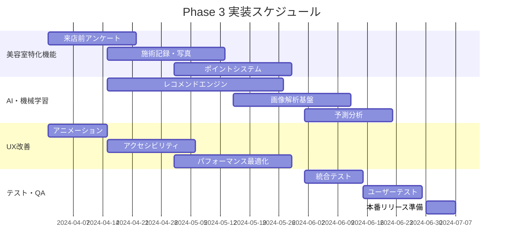

# 段階的実装ロードマップ

## 1. 実装戦略概要

### 1.1 基本方針
**「段階的リリース・継続的改善」**

既存の美容室管理システムを活用しながら、リスクを最小限に抑えた段階的な顧客向けアプリの構築・展開を行う。

### 1.2 実装アプローチ
- **MVP（Minimum Viable Product）**: 核となる機能から開始
- **アジャイル開発**: 2週間スプリントでの反復開発
- **段階的リリース**: フィーチャーフラグを活用した安全な機能展開
- **ユーザーフィードバック**: 各段階でのユーザビリティテスト
- **継続的改善**: データドリブンな機能改善

### 1.3 成功指標（KPI）

```javascript
const SuccessMetrics = {
  // ビジネス指標
  business_kpis: {
    user_adoption: {
      phase_1: '初回登録者 50名以上',
      phase_2: 'アクティブユーザー 200名以上',
      phase_3: '月間予約数 500件以上',
      phase_4: '顧客満足度 4.5/5.0以上'
    },
    
    engagement: {
      daily_active_users: '目標：登録者の30%',
      session_duration: '目標：平均5分以上',
      feature_adoption: '目標：新機能利用率60%以上'
    },
    
    business_impact: {
      repeat_booking_rate: '目標：80%以上',
      no_show_reduction: '目標：現在より20%減少',
      average_booking_value: '目標：10%向上'
    }
  },

  // 技術指標
  technical_kpis: {
    performance: {
      page_load_time: '< 2秒（P95）',
      api_response_time: '< 200ms（P95）',
      availability: '> 99.9%'
    },
    
    quality: {
      bug_rate: '< 1 bug/1000 lines of code',
      security_incidents: '0 incidents',
      test_coverage: '> 80%'
    }
  }
};
```

## 2. Phase 1: MVP基盤構築（2ヶ月）

### 2.1 目標・スコープ

**Phase 1の目標**: 
基本的な顧客認証・プロフィール管理・予約閲覧機能を提供し、技術基盤を確立する。

### 2.2 実装内容

#### 2.2.1 Week 1-2: 開発環境・CI/CD構築

```yaml
# 開発環境セットアップチェックリスト
development_setup:
  repository:
    - ✅ GitHubリポジトリ作成
    - ✅ ブランチ戦略設定（main/develop/feature）
    - ✅ プルリクエストテンプレート作成
    - ✅ Issue テンプレート作成
  
  infrastructure:
    - ✅ Vercel プロジェクト作成
    - ✅ Firebase プロジェクト設定
    - ✅ 環境変数設定（dev/staging/prod）
    - ✅ ドメイン設定
  
  ci_cd:
    - ✅ GitHub Actions ワークフロー
    - ✅ 自動テスト実行
    - ✅ ESLint/Prettier設定
    - ✅ 自動デプロイ設定
  
  monitoring:
    - ✅ Vercel Analytics 設定
    - ✅ Sentry エラートラッキング
    - ✅ ログ出力設定
```

#### 2.2.2 Week 3-4: 認証システム実装

```javascript
// Phase 1 認証機能スコープ
const Phase1AuthFeatures = {
  // 必須機能
  essential: [
    '電話番号認証（SMS OTP）',
    'メールアドレス認証',
    'JWT トークン管理',
    'プロフィール基本情報管理'
  ],
  
  // 実装対象外（Phase 2以降）
  deferred: [
    'SNS連携ログイン',
    '多要素認証（MFA）',
    'デバイス管理',
    'パスワードレス認証'
  ]
};

// 実装タスク詳細
const AuthImplementationTasks = [
  {
    task: 'Firebase Authentication セットアップ',
    estimate: '1日',
    assignee: 'Backend Developer',
    dependencies: []
  },
  {
    task: 'SMS OTP 認証フロー実装', 
    estimate: '3日',
    assignee: 'Backend Developer',
    dependencies: ['Firebase Authentication セットアップ']
  },
  {
    task: 'JWT ミドルウェア実装',
    estimate: '2日', 
    assignee: 'Backend Developer',
    dependencies: ['Firebase Authentication セットアップ']
  },
  {
    task: '認証API エンドポイント実装',
    estimate: '3日',
    assignee: 'Backend Developer', 
    dependencies: ['SMS OTP 認証フロー実装']
  },
  {
    task: 'フロントエンド認証画面実装',
    estimate: '5日',
    assignee: 'Frontend Developer',
    dependencies: ['認証API エンドポイント実装']
  }
];
```

#### 2.2.3 Week 5-6: 基本UI・プロフィール機能

```jsx
// Phase 1 UI実装スコープ
const Phase1UIComponents = {
  // 認証関連
  auth_components: [
    'LoginScreen',          // ログイン画面
    'PhoneVerification',    // 電話番号認証
    'OTPInput',            // OTP入力
    'ProfileSetup'         // 初回プロフィール設定
  ],
  
  // レイアウト
  layout_components: [
    'AppHeader',           // ヘッダー
    'BottomNavigation',    // ボトムナビゲーション
    'LoadingSpinner',      // ローディング
    'ErrorBoundary'        // エラー境界
  ],
  
  // プロフィール
  profile_components: [
    'ProfileView',         // プロフィール表示
    'ProfileEdit',         // プロフィール編集
    'AvatarUpload',        // アバター画像アップロード
    'PreferencesSettings'  // 設定画面
  ]
};

// サンプル実装: プロフィール画面
const ProfileView = () => {
  return (
    <Box>
      <AppHeader title="プロフィール" />
      
      <VStack spacing={6} p={4}>
        <AvatarSection />
        <BasicInfoSection />
        <ContactInfoSection />
        <PreferencesSection />
        
        <Button 
          colorScheme="purple" 
          size="lg" 
          w="full"
          onClick={() => router.push('/profile/edit')}
        >
          プロフィール編集
        </Button>
      </VStack>
    </Box>
  );
};
```

#### 2.2.4 Week 7-8: 予約閲覧機能・テスト

```javascript
// Phase 1 予約機能スコープ（読み取り専用）
const Phase1BookingFeatures = {
  implemented: [
    '予約一覧表示',
    '予約詳細表示', 
    '予約履歴表示',
    '予約ステータス表示'
  ],
  
  not_implemented: [
    '新規予約作成',
    '予約変更・キャンセル', 
    '空き時間検索',
    'リマインダー設定'
  ]
};

// テスト戦略
const Phase1TestStrategy = {
  unit_tests: {
    coverage_target: '80%',
    focus_areas: [
      '認証ロジック',
      'API レスポンス処理',
      'フォームバリデーション',
      'データ変換'
    ]
  },
  
  integration_tests: {
    scenarios: [
      '新規ユーザー登録フロー',
      'ログイン・ログアウト',
      'プロフィール更新',
      '予約データ取得'
    ]
  },
  
  e2e_tests: {
    critical_paths: [
      'ユーザー登録から初回ログインまで',
      'プロフィール閲覧・編集', 
      '予約履歴閲覧'
    ]
  }
};
```

### 2.3 Phase 1 成果物・デリバラブル

```markdown
## Phase 1 デリバラブル

### 技術成果物
- [x] 顧客向けPWAアプリ（基本版）
- [x] 認証API（電話・メール認証）
- [x] プロフィール管理API
- [x] 予約閲覧API
- [x] CI/CD パイプライン
- [x] 監視・ログシステム

### ドキュメント
- [x] API仕様書
- [x] デプロイメント手順書
- [x] テスト結果レポート
- [x] セキュリティチェックリスト

### テスト・品質保証
- [x] 単体テスト（カバレッジ80%以上）
- [x] 結合テスト
- [x] E2Eテスト
- [x] セキュリティテスト
- [x] パフォーマンステスト

### ユーザーテスト
- [x] 美容室スタッフによる操作テスト
- [x] 既存顧客10名による実用テスト
- [x] ユーザビリティレポート
```

## 3. Phase 2: 核心機能実装（3ヶ月）

### 3.1 目標・スコープ

**Phase 2の目標**: 
予約作成・変更機能とメッセージング機能を追加し、実用的な顧客アプリとして完成させる。

### 3.2 実装内容詳細

#### 3.2.1 Month 1: 予約管理機能

```javascript
const Phase2BookingFeatures = {
  // 新規実装機能
  new_features: [
    {
      feature: 'サービス選択・予約作成',
      components: [
        'ServiceSelection',     // サービス選択画面
        'StaffSelection',       // スタッフ選択
        'DateTimeSelection',    // 日時選択
        'BookingConfirmation',  // 予約確認
        'PaymentIntegration'    // 決済統合（Phase 3）
      ],
      apis: [
        'GET /api/v1/services',           // サービス一覧
        'GET /api/v1/staff',              // スタッフ一覧
        'GET /api/v1/availability',       // 空き時間
        'POST /api/v1/appointments',      // 予約作成
        'PUT /api/v1/appointments/:id'    // 予約変更
      ]
    },
    
    {
      feature: '予約変更・キャンセル',
      business_rules: {
        change_deadline: '24時間前まで',
        cancellation_policy: '2時間前まで無料',
        reschedule_limit: '1回まで'
      }
    },
    
    {
      feature: 'リアルタイム空き状況',
      technology: 'WebSocket + Firebase',
      update_frequency: '30秒間隔'
    }
  ]
};

// 予約作成フロー実装例
const BookingFlow = () => {
  const [step, setStep] = useState(1);
  const [bookingData, setBookingData] = useState({
    service: null,
    staff: null,
    date: null,
    time: null
  });

  const steps = [
    { component: ServiceSelection, title: 'サービス選択' },
    { component: StaffSelection, title: 'スタッフ選択' },  
    { component: DateTimeSelection, title: '日時選択' },
    { component: BookingConfirmation, title: '予約確認' }
  ];

  return (
    <Box>
      <BookingProgress currentStep={step} totalSteps={steps.length} />
      
      <AnimatePresence mode="wait">
        <motion.div
          key={step}
          initial={{ opacity: 0, x: 50 }}
          animate={{ opacity: 1, x: 0 }}
          exit={{ opacity: 0, x: -50 }}
        >
          {React.createElement(steps[step - 1].component, {
            data: bookingData,
            onUpdate: setBookingData,
            onNext: () => setStep(step + 1),
            onBack: () => setStep(step - 1)
          })}
        </motion.div>
      </AnimatePresence>
    </Box>
  );
};
```

#### 3.2.2 Month 2: メッセージング・通知システム

```javascript
const Phase2MessagingFeatures = {
  chat_functionality: {
    real_time: 'Socket.IO + Firebase Realtime Database',
    message_types: [
      'text',           // テキストメッセージ
      'image',          // 画像送信
      'appointment',    // 予約関連メッセージ
      'quick_reply'     // クイック返信
    ],
    
    features: [
      '既読・未読管理',
      'タイピングインジケーター',
      'メッセージ検索',
      'ファイル添付',
      'オフライン対応'
    ]
  },
  
  notification_system: {
    channels: [
      'push_notification',  // プッシュ通知
      'in_app',            // アプリ内通知
      'email',             // メール通知
      'sms'                // SMS通知（フォールバック）
    ],
    
    notification_types: [
      'appointment_reminder',    // 予約リマインダー
      'appointment_confirmation', // 予約確認
      'message_received',        // メッセージ受信
      'promotion',               // キャンペーン情報
      'system_update'            // システム更新
    ]
  }
};

// プッシュ通知実装
const NotificationService = {
  // FCM セットアップ
  async initializeFCM() {
    const messaging = getMessaging();
    
    // サービスワーカー登録
    const registration = await navigator.serviceWorker.register('/firebase-messaging-sw.js');
    
    // トークン取得
    const token = await getToken(messaging, {
      vapidKey: process.env.REACT_APP_VAPID_KEY,
      serviceWorkerRegistration: registration
    });
    
    // トークンをサーバーに送信
    await this.sendTokenToServer(token);
    
    return token;
  },
  
  // 通知権限要求
  async requestPermission() {
    const permission = await Notification.requestPermission();
    
    if (permission === 'granted') {
      console.log('Notification permission granted.');
      return true;
    } else {
      console.log('Notification permission denied.');
      return false;
    }
  }
};
```

#### 3.2.3 Month 3: データ同期・オフライン対応

```javascript
const Phase2OfflineFeatures = {
  // オフライン対応戦略
  offline_strategy: {
    data_caching: {
      user_profile: 'permanent',
      appointments: '30_days',
      messages: '7_days',
      services: '24_hours'
    },
    
    offline_actions: [
      'profile_viewing',      // プロフィール閲覧
      'appointment_viewing',  // 予約閲覧
      'message_reading',      // メッセージ読み取り
      'draft_message_saving'  // メッセージ下書き保存
    ],
    
    sync_strategy: {
      background_sync: true,
      conflict_resolution: 'server_wins',
      retry_policy: 'exponential_backoff'
    }
  },
  
  // PWA機能強化
  pwa_enhancements: {
    service_worker: {
      caching_strategies: [
        'cache_first',      // 静的リソース
        'network_first',    // API レスポンス
        'stale_while_revalidate' // 画像
      ],
      
      background_tasks: [
        'message_sync',
        'appointment_updates',
        'notification_handling'
      ]
    }
  }
};

// オフライン対応実装例
class OfflineDataManager {
  constructor() {
    this.db = new Dexie('CustomerAppDB');
    this.setupDatabase();
  }
  
  setupDatabase() {
    this.db.version(1).stores({
      profile: 'id, data, lastSync',
      appointments: 'id, customerId, data, lastSync',
      messages: 'id, conversationId, data, timestamp',
      services: 'id, data, lastSync',
      syncQueue: '++id, type, data, timestamp'
    });
  }
  
  async cacheData(type, data) {
    await this.db[type].put({
      id: data.id,
      data: data,
      lastSync: new Date()
    });
  }
  
  async getCachedData(type, id) {
    return await this.db[type].get(id);
  }
  
  async queueForSync(type, data) {
    await this.db.syncQueue.add({
      type,
      data,
      timestamp: new Date()
    });
  }
}
```

### 3.3 Phase 2 品質保証・テスト

```javascript
const Phase2TestingApproach = {
  // 機能テスト
  functional_testing: {
    booking_scenarios: [
      'サービス選択から予約完了まで',
      '予約変更・キャンセル',
      '空き時間検索',
      'スタッフ指名予約',
      'リピート予約'
    ],
    
    messaging_scenarios: [
      'メッセージ送受信',
      'ファイル添付・送信',
      'プッシュ通知受信',
      'オフライン→オンライン同期',
      'クイック返信使用'
    ]
  },
  
  // パフォーマンステスト
  performance_testing: {
    load_testing: {
      concurrent_users: 100,
      peak_requests_per_second: 500,
      test_duration: '30_minutes'
    },
    
    mobile_performance: {
      devices: ['iPhone 12', 'Galaxy S21', 'Pixel 5'],
      metrics: ['TTI', 'FCP', 'LCP', 'CLS'],
      target: 'Core Web Vitals 全て Green'
    }
  },
  
  // セキュリティテスト
  security_testing: {
    penetration_testing: [
      '認証バイパス',
      '権限昇格',
      'データ漏洩',
      'セッション管理'
    ],
    
    owasp_compliance: [
      'A01 - Broken Access Control',
      'A02 - Cryptographic Failures',
      'A03 - Injection',
      'A07 - Identification and Authentication Failures'
    ]
  }
};
```

## 4. Phase 3: 高度機能・体験向上（3ヶ月）

### 4.1 実装内容

#### 4.1.1 美容室特化機能

```javascript
const Phase3SalonFeatures = {
  // 来店前アンケート
  pre_visit_survey: {
    dynamic_questions: true,
    conditional_logic: true,
    integration: 'appointment_booking',
    analytics: 'customer_insights'
  },
  
  // 施術記録・写真
  treatment_records: {
    photo_management: {
      before_after: true,
      process_photos: true,
      ai_analysis: 'future_phase',
      sharing_controls: 'privacy_first'
    },
    
    styling_advice: {
      personalized_tips: true,
      product_recommendations: true,
      maintenance_schedule: true
    }
  },
  
  // ポイント・特典システム
  loyalty_program: {
    point_earning: [
      'visit_bonus',
      'spending_percentage',
      'review_bonus',
      'referral_bonus',
      'birthday_bonus'
    ],
    
    tier_system: ['regular', 'silver', 'gold', 'platinum'],
    
    rewards: [
      'discount_coupons',
      'free_services',
      'product_discounts',
      'priority_booking'
    ]
  }
};
```

#### 4.1.2 AI・機械学習機能

```javascript
const Phase3AIFeatures = {
  // パーソナライゼーション
  personalization: {
    recommendation_engine: {
      algorithms: ['collaborative_filtering', 'content_based'],
      data_sources: [
        'booking_history',
        'service_ratings',
        'stylist_preferences',
        'seasonal_trends'
      ]
    },
    
    features: [
      'service_recommendations',
      'stylist_matching',
      'optimal_booking_times',
      'product_suggestions'
    ]
  },
  
  // 画像解析（将来拡張）
  image_analysis: {
    hair_condition: 'basic_analysis',
    style_matching: 'template_based',
    color_simulation: 'future_phase'
  },
  
  // 予測分析
  predictive_analytics: {
    no_show_prediction: 'ml_model',
    churn_risk_detection: 'statistical_model',
    optimal_pricing: 'future_phase'
  }
};
```

### 4.2 Phase 3 実装スケジュール



## 5. Phase 4: スケーリング・最適化（2ヶ月）

### 5.1 スケーラビリティ対応

```javascript
const Phase4ScalingStrategy = {
  // インフラ最適化
  infrastructure: {
    cdn_optimization: 'global_edge_network',
    database_scaling: 'read_replicas + connection_pooling',
    caching_layers: 'redis_cluster + application_cache',
    load_balancing: 'application_load_balancer'
  },
  
  // マイクロサービス分離
  microservices: {
    services: [
      'customer_service',
      'appointment_service', 
      'messaging_service',
      'notification_service',
      'analytics_service'
    ],
    
    communication: 'rest_api + event_driven',
    service_mesh: 'future_consideration'
  },
  
  // 監視・運用
  observability: {
    metrics: 'prometheus + grafana',
    logging: 'structured_logging + elk_stack',
    tracing: 'distributed_tracing',
    alerting: 'pagerduty + slack'
  }
};
```

### 5.2 国際化・多言語対応

```javascript
const Phase4Internationalization = {
  // 多言語対応
  i18n: {
    supported_languages: ['ja', 'en', 'ko', 'zh'],
    framework: 'react-i18next',
    content_management: 'crowdin',
    fallback_language: 'ja'
  },
  
  // 地域対応
  localization: {
    currency: 'multi_currency_support',
    date_time: 'timezone_aware',
    phone_number: 'international_format',
    address: 'regional_address_format'
  },
  
  // 文化適応
  cultural_adaptation: {
    ui_patterns: 'regional_preferences',
    color_schemes: 'cultural_sensitivity',
    content_tone: 'local_communication_style'
  }
};
```

## 6. リリース戦略・展開計画

### 6.1 段階的リリース計画

```javascript
const ReleaseStrategy = {
  // ベータテスト（Phase 1完了後）
  beta_testing: {
    participants: {
      internal: '美容室スタッフ 10名',
      external: '既存顧客 50名',
      duration: '4週間'
    },
    
    feedback_collection: [
      'app_store_reviews',
      'in_app_feedback',
      'user_interviews',
      'analytics_data'
    ]
  },
  
  // 段階的公開（Phase 2完了後）
  gradual_rollout: {
    week_1: '既存顧客の10%',
    week_2: '既存顧客の30%', 
    week_3: '既存顧客の60%',
    week_4: '既存顧客の100%',
    month_2: '新規顧客への公開'
  },
  
  // フィーチャーフラグ戦略
  feature_flags: {
    new_booking_system: 'gradual_rollout',
    ai_recommendations: 'beta_users_only',
    loyalty_program: 'full_release',
    advanced_analytics: 'staff_only'
  }
};
```

### 6.2 マーケティング・プロモーション

```javascript
const MarketingPlan = {
  // 顧客コミュニケーション
  customer_communication: {
    announcement: {
      channels: ['email', 'sms', 'in_salon_poster'],
      timeline: '2週間前から告知開始'
    },
    
    onboarding: {
      welcome_email: 'app_download_guide',
      tutorial_video: 'key_features_walkthrough',
      support: 'dedicated_help_desk'
    }
  },
  
  // インセンティブプログラム
  incentives: {
    early_adopters: '初回利用で500ポイント',
    referral_bonus: '友達紹介で1000ポイント',
    review_bonus: 'アプリレビューで200ポイント'
  },
  
  // 成果測定
  success_metrics: {
    download_rate: '既存顧客の80%以上',
    activation_rate: 'ダウンロード者の60%以上が初回予約',
    retention_rate: '1ヶ月後のアクティブ率50%以上'
  }
};
```

## 7. 運用・保守計画

### 7.1 継続的改善プロセス

```javascript
const ContinuousImprovement = {
  // データドリブン改善
  data_driven_improvements: {
    analytics_review: 'weekly',
    feature_usage_analysis: 'bi_weekly',
    user_feedback_analysis: 'monthly',
    a_b_testing: 'continuous'
  },
  
  // 定期アップデート
  regular_updates: {
    minor_updates: 'bi_weekly',
    major_updates: 'quarterly',
    security_patches: 'as_needed',
    dependency_updates: 'monthly'
  },
  
  // ユーザーサポート
  user_support: {
    help_center: 'self_service_documentation',
    chat_support: 'business_hours_only',
    video_tutorials: 'feature_specific_guides',
    faq: 'frequently_updated'
  }
};
```

### 7.2 技術負債管理

```javascript
const TechnicalDebtManagement = {
  // 負債特定・評価
  debt_identification: {
    code_quality_metrics: 'sonarqube',
    performance_monitoring: 'lighthouse + web_vitals',
    security_scanning: 'snyk + github_security',
    dependency_analysis: 'dependabot'
  },
  
  // 対処優先順位
  priority_matrix: {
    high_impact_high_effort: 'quarterly_planning',
    high_impact_low_effort: 'immediate_fix',
    low_impact_high_effort: 'background_task',
    low_impact_low_effort: 'maintenance_window'
  },
  
  // リファクタリング計画
  refactoring_strategy: {
    code_cleanup: '20% of sprint capacity',
    architecture_improvement: 'dedicated_sprint',
    performance_optimization: 'continuous',
    security_hardening: 'monthly_review'
  }
};
```

## 8. リスク管理・コンティンジェンシープラン

### 8.1 主要リスクと対策

| リスク | 確率 | 影響度 | 対策 | コンティンジェンシー |
|--------|------|--------|------|---------------------|
| **技術的障害** | 中 | 高 | 冗長化、監視強化 | 即座にロールバック |
| **ユーザー採用率低迷** | 中 | 高 | ユーザーテスト強化 | マーケティング戦略見直し |
| **セキュリティ侵害** | 低 | 高 | 多層防御、定期監査 | インシデント対応チーム |
| **第三者サービス障害** | 中 | 中 | フォールバック実装 | 代替サービス切り替え |
| **法規制変更** | 低 | 中 | 法務チーム連携 | コンプライアンス体制強化 |

### 8.2 成功の判断基準

```javascript
const SuccessGates = {
  phase_1_success: {
    user_registration: '>= 50 users',
    app_stability: 'uptime >= 99.5%',
    user_satisfaction: 'rating >= 4.0',
    security_incidents: '0 incidents'
  },
  
  phase_2_success: {
    monthly_active_users: '>= 200',
    booking_completion_rate: '>= 85%',
    message_response_time: '<= 2 minutes',
    performance_score: 'lighthouse >= 90'
  },
  
  phase_3_success: {
    feature_adoption_rate: '>= 60%',
    customer_retention: '>= 80%',
    nps_score: '>= 70',
    roi_achievement: 'positive_roi'
  },
  
  overall_success: {
    business_impact: 'revenue_increase >= 15%',
    operational_efficiency: 'no_show_rate_reduction >= 20%',
    customer_satisfaction: 'csat >= 4.5',
    technical_excellence: 'zero_critical_bugs'
  }
};
```

この実装ロードマップに従うことで、リスクを最小限に抑えながら、美容室顧客向けアプリを段階的に構築・展開し、継続的な価値提供を実現できます。各フェーズでの明確な成功基準と柔軟な対応計画により、プロジェクトの成功確率を最大化します。